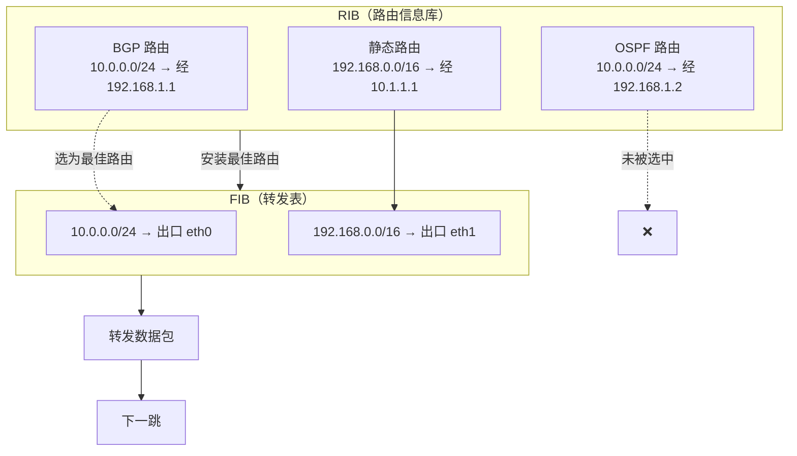

当你点开这篇文章时，你可能对 BGP 只有一个模糊的印象，但没关系，我们先把概念重新说一遍~~虽然很多时候你未必真用得上~~。

# 什么是 BGP

以下文段来自[维基百科](https://zh.wikipedia.org/wiki/%E8%BE%B9%E7%95%8C%E7%BD%91%E5%85%B3%E5%8D%8F%E8%AE%AE)

> **边界网关协议**（英语：Border Gateway Protocol，缩写：BGP）是[互联网](https://zh.wikipedia.org/wiki/互联网)上一个核心的去中心化自治[路由协议](https://zh.wikipedia.org/wiki/路由协议)。它通过维护 IP[路由表](https://zh.wikipedia.org/wiki/路由表)或"前缀"表来实现[自治系统](https://zh.wikipedia.org/wiki/自治系统)（AS）之间的可达性，属于矢量路由协议。BGP 不使用传统的[内部网关协议](https://zh.wikipedia.org/wiki/内部网关协议)（IGP）的指标，而使用基于路径、网络策略或规则集来决定路由。因此，它更适合被称为矢量性协议，而不是路由协议。

简而言之，BGP 是在自治系统之间交换路由信息的最主要协议（虽然思科的 EIGRP 技术上也支持跨自治系统路由，但在真实世界几乎没有应用）。BGP 的核心作用是在自治系统之间传递路由信息，并通过路径属性和策略来选择并传播“最优路径”。

# 路由

如果你看到这里，说明你对“路由”应该已经有了基础认识。简单来说， **路由 (Route)** 作为名词，指的是“某个 IP 段要从哪条线路、走哪个网关出去”；作为动词，就是路由器在收到数据包后，帮它找出应该走哪条路的过程。路由表，顾名思义，就是记录了若干条路由信息的表格。

在路由表里，除了目的网络段和下一跳，还会包含失效时间、度量值、路由来源等附属信息。例如，下面是一条在 Linux 中查看到的去往 `10.2.5.0/24` 的路由：

```shell
10.2.5.0/24 via 10.254.0.34 dev wg0 proto bird src 10.2.3.1 metric 32
```

来拆解一下：

- `10.2.5.0/24` 目标 IP 段
- `via 10.254.0.34` 下一跳的 IP
- `dev wg0` 目标接口
- `proto bird` 路由来源的协议，此处为 bird 指的是从 bird 写入
- `src 10.2.3.1` 当这跳转发的来源是本机的时候，采用的源地址 IP
- `metric 32` 路由度量值，存在多个对同一 IP 段的路由时用来决定选择哪条路由来使用，metric 越小路由优先级越高


:::tip 额外拓展
{/* prettier-ignore */} 
在 Linux 内：
 - 如果同时有 `dev` 和 `via`，系统会根据 ARP 表把目标 MAC 改写成下一跳的 MAC（若 ARP 表中没有，则会通过 `dev` 指定的接口发起 ARP 查询）。
 - 如果只有 `dev` 没有 `via`，则直接用 ARP 表查找目标地址的 MAC（同样若无记录则发起 ARP），然后通过指定接口转发。
 - 如果只有 `via` 没有`dev`，会递归查询直至找到包含 `dev` 的下一跳，然后按上面规则转发。
:::


但你可能不知道的是，在路由器内部，路由表其实分成两张：在大多数商业路由器里，路由表分为 **RIB（Routing Information Base，路由信息库）** 和 **FIB（Forwarding Information Base，转发表）**。RIB 汇聚来自各种协议和配置的路由信息，经过选路后，只有最优路由会被安装到 FIB，供硬件用于实际数据转发。下面这张图就展示了 RIB 到 FIB 的过程。本教程中，Bird 就负责管理 RIB，而 Linux 内核就是我们的转发表 FIB。



# ASN、前缀、IRR 与 RPKI


:::note
  本教程不包含如何申请 ASN 与 IP 的具体流程，请自行搜索 LIR 相关的申请教程。
:::


你打算购买自己的 ASN 和 IP ，开始自己的 BGP 生涯。但在你搜索的时候，你对它们的关系陷入了疑惑。这两个有什么从属关系吗？如果没有从属关系，那 IP 广播又为什么会用到 ASN 呢？同时你也看到了一个新词：前缀。前缀又是什么呢？

- **ASN（Autonomous System Number）** 即自治系统编号，用来标识一个自治系统（AS, Autonomous System）。一个自治系统通常代表一家企业、机构或某项网络业务，比如 Google（AS15169）、Cloudflare（AS13335）、Lumen（AS3356）。同一个公司在不同地区也可能使用多个 ASN（例如 Misaka Network Inc）。ASN 由五大 RIR（区域互联网注册机构，如 APNIC、ARIN、RIPE NCC）分配，NIR（国家互联网注册机构，如 CNNIC）或 LIR（地方互联网注册机构）可以代理申请。NIR、RIR 通常不接受个人业务，所以我们自己用 ASN 一般都是找 LIR 申请。

- **前缀（Prefix）**，也叫 IP 段，是指一段连续的 IP 地址。组织通常以块为单位申请和广播 IP。在 IPv4 中，/24 是最小的可单独广播单位；在 IPv6 中则是 /48。

前缀和 ASN 在申请时彼此独立。一个组织可以拥有多个前缀和多个 ASN。但在广播时，每个前缀都必须由一个起源 ASN（Origin AS）对外发布，未经授权广播他人 IP 就是“盗播”。那么 IP 的授权是如何确认的呢？这就涉及 IRR 和 RPKI。

钱虽然好用，但你家的钱只有你能花——IP 也是一样，只有 IP 的主人才能授权给别的 ASN 用。未经许可的 ASN 广播 IP，就成盗播了。那 IP 是怎么授权给别人用的呢？这就要提到 IRR 和 RPKI 了。

- **IRR（Internet Routing Registry）** 是一个分布式数据库系统，用于登记和查询路由信息如路由对象（route object），而路由对象上就记录了哪个前缀可以用于哪个 ASN 。常见的 IRR 可在 https://irr.net/registry/ 查询。除了五大 RIR 自建的 IRR 外，还有像 RADB、ALTDB、LEVEL3 等企业或第三方运营的 IRR。目前 IRR 仍是主流的归属管理方式，但因为分散、验证较弱，存在滥用风险。下面是 `1.1.1.0/24` 的 IRR 记录，采用 RPSL 语言，里面标识了起源 AS。

```yaml
route: 1.1.1.0/24
origin: AS13335
descr: APNIC Research and Development
  6 Cordelia St
mnt-by: MAINT-APNICRANDNET
last-modified: 2023-04-26T02:42:44Z
source: APNIC
```

- **RPKI（Resource Public Key Infrastructure）** 是一种基于公钥基础设施的路由验证机制，通过数字签名和证书链验证 IP 和 ASN 的对应关系，防止路由被劫持或冒用。RPKI 是对 IRR 的补充甚至替代，但普及仍在进行中。

目前 RPKI 的推进虽然有所成效，但还十分缓慢，所以一般（五大 RIR 的）IRR 才是判断 IP 是否能够被某个 ASN 广播的金标准。但新的 IP 段授权的时候，一般会同时加上 IRR 和 RPKI。

# BGP Session 、 BYOIP 与 IP Transit

申请完了 ASN 和 IP，你打算去买一个能够使用你的 IP 的服务。但当你找寻相关的服务时，你看到了诸如"BGP Session", "BYOIP" 和 "IP Transit" 之类的名词，让你眼花缭乱。这些名词究竟指的是什么？

- **BGP Session** 指的是与服务商建立 Border Gateway Protocol（边界网关协议）会话的服务，常见于 IDC（数据中心）环境中。通过建立 BGP 会话，你可以将自己的 IP 地址广播到互联网，并通常能够接收到完整的 BGP 路由表（即“全表”）。这种服务多见于各类虚拟服务器，大多数情况下，BGP Session 所产生的流量会与你自身网络的出入流量合并计算。

通常而言，我们需要找的是带有 BGP Session 的 VPS。

- **BYOIP** 指的是“自带 IP 地址”的服务，常见于云计算平台（如 AWS、GCP）和部分 SaaS 提供商（如 Cloudflare）。这项服务允许你将自己的 IP 地址段（通常是 RIR 分配的）映射到云平台上使用。

与 BGP Session 和 IP Transit 不同的是，许多 BYOIP 服务**并不直接与用户建立 BGP 会话**。虽然服务商依然会使用 BGP 将你的 IP 广播到互联网，但你作为用户通常只需在控制面中提交 IP 段，后台由平台负责路由发布。因此，从你的角度看，它更像是使用一个“静态 IP”，而不是动态的路由对等关系。

- **IP Transit** 是最传统意义上的“接入互联网”服务，主要提供商是 ISP 或上游运营商。购买 IP Transit 意味着你可以使用对方的网络作为通往整个互联网的“高速公路”。

IP Transit 通常包含与对方建立 BGP Session 的能力，以便你用自己的 AS（自治系统号）广播自有的 IP 地址段。这使得你能将自己的网络纳入全球互联网的路由体系中。它的计费单位一般是 Mbps/月，采用 95 分位计费（95th percentile billing）：每 5 分钟记录一次带宽使用量，去掉全月中最高的 5% 样本后，剩下的最大值作为该月计费带宽。

需要注意的是，**IP Transit 提供的是“通向互联网的路径”本身**，而不是像 DIA（Dedicated Internet Access）那样只提供几个静态 IP 给你使用，通常不带 BGP 功能。DIA 常面向企业客户，IP Transit 则更偏向网络服务商、内容分发商等具备一定网络运营能力的客户。

# BIRD

有了带 BGP Session 的 VPS 后，你需要一个路由软件来建立 BGP 连接。以前这需要昂贵的硬件路由器，如今只需在 Linux 上安装路由守护进程即可。常见的有 `FRR`、`OpenBGPD`，而本教程将使用 BIRD。

## 什么是 BIRD

以下文段来自 [BIRD 中文文档](https://bird.xmsl.dev/docs/user-guide/1-1-introduction.html)

> BIRD 全称 `BIRD Internet Routing Daemon`，旨在开发一个功能完备的动态 IP 路由守护进程 (Routing Daemon)，主要针对 Linux、FreeBSD 等其他类 UNIX (UNIX-like) 系统开发适配，完整源代码采用 [GNU 通用公共许可证](https://zh.wikipedia.org/wiki/GNU通用公共许可证) ([GNU General Public License](https://en.wikipedia.org/wiki/GNU_General_Public_License)) 协议发布，它负责在运行 IP 协议的互联网上的路由器之间传递路由信息。
>
> BIRD 此前是 [布拉格查拉斯大学 (Charles University in Prague)](https://en.wikipedia.org/wiki/Charles_University) 数学和物理学院的一个研究项目。 从 2009 年开始由捷克域名注册机构 - [CZ.NIC Labs](https://labs.nic.cz/) 接手项目并全权负责开发和维护。
>
> 路由器一般只与相邻的路由器交换路由信息，这样就可以快速发现网络中的拓扑结构，以找到到达目标路由器的最佳（以某种度量为基础）路径，并不断地更新路由表，以便在网络拓扑发生变化（如链路故障、新增链路）时，能够及时地找到最新的最佳路径。
>
> 在 BIRD 出现之前，这些路由器之间的路由信息交换是通过价格昂贵的专用硬件完成的，而 BIRD 的出现，使得这些路由器可以通过普通的计算机（通常是运行 Linux 或类 UNIX 的操作系统）来实现。

## BIRD 的版本变迁

Bird 目前有三个大版本：v1, v2, v3

### v1

Bird v1 是最早的 Bird，由两个守护进程分别支持 IPv4 与 IPv6 的路由，最晚版本是 1.6.8，于 2019 年 9 月 11 日发布，现已不推荐使用。

### v2

Bird v2 是目前 Bird 的主线版本。与 v1 相比，v2 仅使用一个守护进程来运行 v4 与 v6 的路由。在本教程中，我们将使用 Bird v2 作为路由守护进程。

### v3

Bird v3 是 Bird 的下一代版本，该版本增加了多线程的支持，仍在完善中。

## 如何安装 BIRD

请参阅 [BIRD 中文文档：如何安装 BIRD](https://bird.xmsl.dev/docs/user-guide/1-2-installing.html)

## Bird 的基本语法

请参阅 [BIRD 中文文档：BIRD 配置](https://bird.xmsl.dev/docs/user-guide/3-1-introduction.html)

路由基础概念的讲解到此就告一段落。如果你还想了解更多，欢迎你前往 [Cloudflare 的网络层知识](https://www.cloudflare.com/zh-cn/learning/network-layer/what-is-the-network-layer/) 进行阅览。下一章，我们将带你使用 Bird 与服务提供商建立 BGP 会话，完成你的第一次广播。
