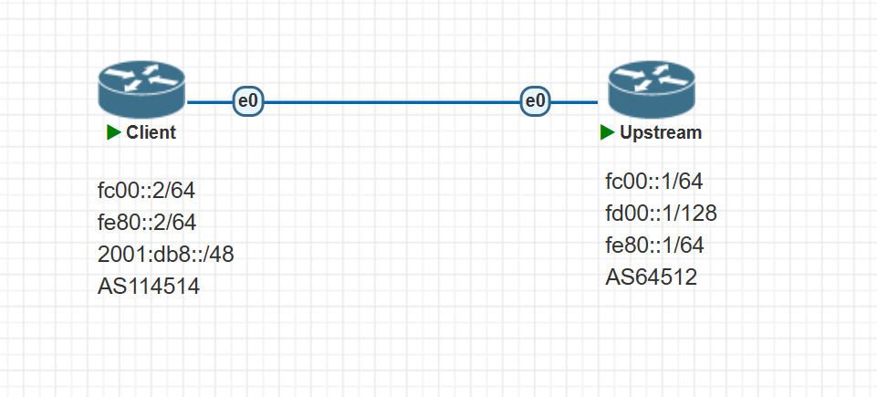

看完 [开始之前](/beginner/before/) 后，你应该对路由和 BGP 有了基本的概念，并且已经在你的机器上安装好了 BIRD。假设你手里有了一段属于自己的 IP 前缀（比如 `2001:db8::/48`）和一个上游分配给你的对端 ASN 与 IP 地址。现在，我们要做的就是：把这段 IP 广播出去，让全世界都能访问到这块地址。

考虑到大多数 BGP Player 当前主要持有 IPv6 段，本章示例将以 IPv6 为主，IPv4 的配置思路完全类同，可自行举一反三。

---

# 场景示例



## 客户（Client）

- **ASN**：AS114514
- **IP**：
  - `fc00::2/64`（与上游的内网地址）
  - `fe80::2/64`（链路本地地址）
  - `2001:db8::/48`（对外广播的 IPv6 前缀）

## 上游（Upstream）

- **ASN**：AS64512
- **IP**：
  - `fc00::1/64`（与客户的内网地址）
  - `fd00::1/128`（多跳 BGP 对端地址）
  - `fe80::1/64`（链路本地地址）

> 客户端系统：Debian 12
>  BIRD 版本：2.17.1

---

# 虚拟网卡

广播 IP 段的最终目的是让你的机器实际使用这些地址。那么怎么用？最简单的做法，就是在本地创建一个虚拟网卡（dummy 网卡），并把你需要广播的 IP 前缀里的某个地址绑定到这个网卡上。

以 Debian 为例，你可以在 `/etc/network/interfaces` 中添加如下配置（这里以前面示例的前缀为例）：

```interfaces
iface dummy0 inet6 static
    address 2001:db8::1/128
    pre-up ip link add dummy0 type dummy
    post-down ip link del dummy0 type dummy
```

这里我们创建了一个名为 `dummy0` 的虚拟网卡，并为其分配了一个地址 `2001:db8::1/128`。注意这里使用的是 `/128` 而不是 `/64` 或 `/48`，因为我们只需要绑定这个段内的**一个**地址来宣布路由，机器本身并不需要在该网卡上与其他设备通信，也就不需要整个子网。

保存后，执行 `ifup dummy0` ：

```shell
root@debian:~# ifup dummy0
Waiting for DAD... Done
root@debian:~# 
```

如果如上所示，`dummy0` 启动时没有任何错误，那么虚拟网卡已经成功创建，可以用于后续 BGP 广播。

---

# 配置 BIRD

**BIRD** 安装好后，`/etc/bird/bird.conf` 默认会带有一份 200 多行的示例配置文件，里面展示了 **BIRD** 的多种用法。你可以先备份一份以备研究，但在这里我们先将其清空，从零开始编写。执行以下命令即可：

```
echo > /etc/bird/bird.conf
```

这样就得到了一个空白的配置文件。

**注意：请不要随意修改 `envvars` 文件**。它对 **BIRD** 服务正常运行至关重要。如果误改，可按以下内容恢复：

```
BIRD_RUN_USER=bird
BIRD_RUN_GROUP=bird
#BIRD_ARGS=
```

## 基本配置

```bird2 showLineNumbers {2, 8, 15} 
log syslog all;
router id 10.0.0.1; # 需要替换成机器上的任意 IPv4 地址，或直接删掉该行让 BIRD 自动选择
define ASN = 114514; # 定义本地使用的 ASN
define OWN_IPv6 = [2001:db8::/48]; # 定义将要对外宣布的 IPv6 段
protocol device {
};
protocol kernel {
    ipv6 {
        export filter {
            krt_prefsrc = 2001:db8::1; # 指定使用的源地址，如dummy0接口绑定的地址
            accept;
        };
    };
};
protocol static static_v6 {
    ipv6;
    route 2001:db8::/48 reject; #在 static 中添加你需要广播的路由
};
```

这是 **BIRD** 配置的起手式。它主要包含以下内容：

- 定义 `router id`、`ASN` 和 `OWN_IPv6`（自有前缀）
- `protocol device`：让 **BIRD** 能读取系统的网络接口信息
- `protocol kernel`：用于将 **BIRD** 学到的路由写回内核路由表
- `protocol static`：用于声明静态路由

注意看第 7–10 行，这里我们没有简单写 `export all`，而是使用了 `filter`。这是因为我们希望所有通过 BGP 学到的路由（通常是全网路由）在被系统使用时，都能以我们自己的地址作为源地址，而不是服务商分配的地址~~BGP不用自己的地址那还有什么意义~~。所以，这里通过 `krt_prefsrc` 参数显式指定了默认源地址。**请务必确保这个地址已在某个接口（如 dummy0）上绑定**，否则你会在日志里收获大量的 `RTNETLINK answers: Invalid argument` 报错。

`static` 协议用于在 BIRD 内定义要广播的路由，示例如下（引用自 [Soha 的新手教程](https://github.com/moesoha/bird-bgp-kickstart/blob/master/main.md#协议-protocol)）：

```bird2
protocol static {
    ipv6; # 启用 ipv6 channel，否则不会收集 IPv6 路由

    route 2001:db8:100a::/48 reject;
    # 定义一条路由 2001:db8:100a::/48 为 reject/unreachable
    route 2001:db8:100b::/48 via "eth0";
    # 定义一条路由 2001:db8:100b::/48 的下一跳为 eth0，也就是说会在eth0内发邻居请求报文NS（Neighbor Solicitation）寻找IP所在的机器
    route 2001:db8:100c::/48 via 2001:db8:eeee::1;
    # 定义一条路由 2001:db8:100c::/48 的下一跳为 2001:db8:eeee::1
}
```

一般来说，如果只是为了对外宣布一个段，通常会用 `reject` 作为下一跳（见第 15 行），这是因为数据包到达后，实际的转发由 Linux 的路由表负责，而你的 Linux 路由表通常会包含更细化的路由（例如 dummy0 上绑定的 `/128`）。如果找不到更具体的匹配，说明这个段暂时未使用，可直接返回 `unreachable`。除非有特殊需求，否则没必要给整个 `/48` 设置一个实际的下一跳。

## 过滤器

之所以在讲完基本配置之后就要讲过滤器，是因为不论你是持证专家（CCIE/JNCIE/HCIE 等）还是刚入门的 BGP Player，**管好自己发出的路由都是最基本的责任，也是对他人最起码的尊重**。由于过滤器配置疏忽而引发的路由泄漏、服务中断乃至全球事故比比皆是，去 Cloudflare Blog 随便搜就能找到一大堆案例。好消息是，对于新手来说，并不需要很复杂的过滤器：只要保证**只发自己的路由**、**收上游的全部路由**即可。

以下是最简单的示例：

```bird2 {3}
filter export_filter_v6 {
    if net ~ OWN_IPv6 then accept; # 如果前缀属于 OWN_IPv6，则放行
    reject; # 否则拒绝
};
filter import_filter_v6 {
    accept; # 照单全收
};
```

建议在编写过滤器时，始终**显式地定义 accept 的条件，并在末尾用 reject 兜底**，像第 3 行一样，切勿偷懒。

更多过滤器的用法可以参考 [Soha 的教程](https://github.com/moesoha/bird-bgp-kickstart/blob/master/main.md#3-过滤过滤) 或 [BIRD 中文文档](https://bird.xmsl.dev/docs/user-guide/5-1-introduction.html)。要记住： **对于路由过滤，无论再怎么小心都不为过。你少写的每一个字符，都可能造成几百万美元的损失和几个小时的全球停机。** 

# 配置BGP

完成了基本配置和过滤器之后，就可以开始配置 BGP 会话了。一般来说，你会从上游服务商那里拿到对方的 IP、ASN，有时还会包含密码（例如 Vultr 常见）。
 根据对端 IP 是否和你在同一个网段，BGP 会话大致可以分为「多跳」和「同段」两种；其中 `fe80` 链路本地地址是同段中的一种特殊情况。

## 多跳会话

假设你从服务商获得的信息是：

> **ASN**：AS64512
>
> **IP**：`fd00::1/128`

此时你会发现，对方 IP 并不在你的本地子网里，但可以正常 `ping` 通，这种情况通常就需要配置 **多跳（multihop）** BGP。

示例配置：

```bird2 {1-3, 7-8, 10}
protocol bgp upstream {
    local fc00::2 as ASN;
    neighbor fd00::1 as 64512;
    multihop 2;
    # password OURPASSWORD; 密码，可选
    ipv6 {
        import filter import_filter_v6;
        export filter export_filter_v6;
    };
    graceful restart;
};
```

解释如下：

```bird2 startLineNumber=1
protocol bgp upstream {
```

定义了一个会话实例，`upstream` 是该实例的名字，可自定义。

```bird2 startLineNumber=2
    local fc00::2 as ASN;
    neighbor fd00::1 as 64512;
```

指定了本地用于会话的 IP 和 ASN，以及对端（上游）的 IP 和 ASN。其中 `ASN` 是前面 `define` 过的常量。

```bird2 startLineNumber=4
    multihop 2;
```

表明这是一个多跳会话，`2` 表示 BGP 报文的 Hop Limit（最大跳数）。你可以使用 `mtr` 等工具测量到对端的实际网络跳数后设置一个合适的值。一般来说，这个值与实际相符即可，设置略大也没关系，但太大可能降低安全性。

```bird2 startLineNumber=7
        import filter import_filter_v6;
        export filter export_filter_v6;
```

指定了该会话的 IPv6 通道使用的过滤器，均为前面定义好的过滤器。

```bird2 startLineNumber=10
    graceful restart;
```

启用 **Graceful Restart**，可以在重启 BIRD 或重新加载配置时最大程度减少会话中断时间。

## 同段会话

若对方分配给你的 IP 和你的 IP 在同一个子网，例如 `fc00::1/64` 对应你的 `fc00::2/64`，则属于同段配置，示例如下：

```bird2 {4}
protocol bgp upstream {
    local fc00::2 as ASN;
    neighbor fc00::1 as 64512;
    direct;
    ipv6 {
        import filter import_filter_v6;
        export filter export_filter_v6;
    };
    graceful restart;
};
```

其中第四行的

```bird2 startLineNumber=4
    direct;
```

表示本地 IP 和对端 IP 处于同一广播域（同段），此时 BGP 报文的 Hop Limit 默认就是 1。

## 链路本地地址

在某些场景（例如 DN42 社区网络），对方可能不会给你公网或内网地址，而是直接给一个 `fe80` 开头的地址。这类 **链路本地地址（Link-local address）** 只在同一个网段/广播域有效，无法跨路由传播。
 也就是说，该地址只对与之直连的网卡有效，若需要使用 `fe80` 地址建连，就必须 **显式指定本地使用的网卡**。

假设上游分配的地址为 `fe80::1`，且你的设备网卡为 `eth0`，示例配置如下：

```bird2 {%eth0}
protocol bgp upstream {
    local fe80::2 as ASN;
    neighbor fe80::1%eth0 as 64512;
    direct;
    ipv6 {
        import filter import_filter_v6;
        export filter export_filter_v6;
    };
    graceful restart;
};
```

其中 `fe80::1%eth0` 就是指定使用 `eth0` 网卡的链路本地地址格式。

## 启动并验证

将上述示例根据你的实际情况 **三选一** 填入 `bird.conf`，然后执行 `birdc c`，若未出现任何报错，说明配置无误。稍等片刻后，运行 `birdc s p`，若输出中 `State` 显示为 `Established`，则表明 BGP 会话已成功建立，示例如下：

```shell
root@debian:~# birdc s p 
BIRD 2.17.1 ready.
Name       Proto      Table      State  Since         Info
device1    Device     ---        up     2025-06-27    
kernel1    Kernel     master6    up     2025-06-27    
static_v6  Static     master6    up     2025-06-27    
upstream   BGP        ---        up     12:39:32.775  Established   
root@debian:~# 
```

若一切正常，你的前缀就已经对外宣布出去。大约 24 小时后，全球其他网络应能访问到你的前缀。恭喜你，完成了人生第一次广播！

# 全部配置

以多跳为例：

```bird2
log syslog all;
router id 10.0.0.1; # 需要替换成机器上的任意 IPv4 地址，或直接删掉该行让 BIRD 自动选择
define ASN = 114514; # 定义本地使用的 ASN
define OWN_IPv6 = [2001:db8::/48]; # 定义将要对外宣布的 IPv6 段
protocol device {
};
protocol kernel {
    ipv6 {
        export filter {
            krt_prefsrc = 2001:db8::1; # 指定使用的源地址，如dummy0接口绑定的地址
            accept;
        };
    };
};
protocol static static_v6 {
    ipv6;
    route 2001:db8::/48 reject; #在 static 中添加你需要广播的路由
};
filter export_filter_v6 {
    if net ~ OWN_IPv6 then accept; # 如果前缀属于 OWN_IPv6，则放行
    reject; # 否则拒绝
};
filter import_filter_v6 {
    accept; # 照单全收
};
protocol bgp upstream {
    local fc00::2 as ASN;
    neighbor fd00::1 as 64512;
    multihop 2;
    # password OURPASSWORD; 密码，可选
    ipv6 {
        import filter import_filter_v6;
        export filter export_filter_v6;
    };
    graceful restart;
};

```


