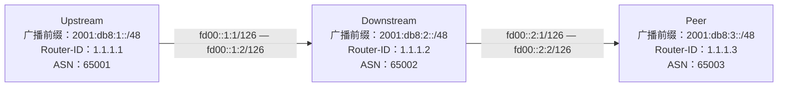

import { Tabs, TabItem, Aside, Code } from "@astrojs/starlight/components";

慢慢地，你会遇到一些志同道合的人。他们有的说想和你建立对等（peer）关系，有的说要做你的下游，有的甚至愿意当你的上游。这时，你也许会疑惑：peer、下游、上游到底指什么？我该如何与他们建立连接、互相收发路由？

别担心，本文将帮助你理解 BGP 中这些核心概念，并教你如何与上下游和同行正确连接。

# 概念解析

## 上、下游与对等

在网络连接中，作为一个自治系统（AS），其他人与你的关系主要有三种：

- **上游（Upstream）**：例如你服务商就是你的上游。上游通常会向你提供 BGP 全表，即整个互联网的路由，让你能顺利接入全球互联网。而你只需要向上游广播你自己及下游的路由。一般来说，上游需要付费购买（如 IP Transit），但也有出于学术、爱好等目的提供免费服务的（如 [HE](https://he.net) 的 IPv6 Transit，用于推广 IPv6 覆盖~~以及在 IPv6 时代争夺 T1 地位~~）。
- **下游（Downstream）**：相反，你对你的客户就是他们的上游。你的下游向你广播他们及他们下游的路由，而你需要向他们提供全表，让他们也能接入互联网。
- **对等（Peer）**：如 Google 与 Microsoft 互为 Peer。Peer 之间直接互联主要为了降低延迟（如同在 IX 交换）并节省费用，双方通常互换自己的路由及下游路由而不走上游。Peer 关系多见于互联网交换中心（IX），如 SFMIX、DE-CIX、EIE（Equinix Internet Exchange），国内也有前海 IX、杭州 IX 等新兴力量。

Peer 有两层含义，一种是名词，或者说是在商业层面上的**对等**，具体见上；一种是在协议层面上的**对等**，为动词，也就是建立 BGP 连接，但通常建立的都是 Peer 关系。

## Tier 1,2,3

> 您们好。
> 我们公司实际上是一级运营商(Tier 1 – AS 174)，在全球包括美洲、欧洲、亚洲超过 199 个市场（40 多个国家）都设有节点。在多个国家都有接点数据中心。
>
> ......

不知道你有没有收到过，这是 Cogent 的一封推广邮件。这里面出现了一个名词：一级运营商。那什么是一级运营商呢？

以下内容抄自[维基百科](https://zh.wikipedia.org/wiki/Tier_1%E7%BD%91%E7%BB%9C)

> **Tier 1 网络**（Tier 1 network）是一种仅通过免费[对等互联](https://zh.wikipedia.org/wiki/Peering)（settlement-free interconnection、settlement-free peering）即可到达[互联网](https://zh.wikipedia.org/wiki/互联网)所有其他网络的[网际协议](https://zh.wikipedia.org/wiki/网际协议)网络。
>
> ......
>
> 最合理的定义是，Tier 1 网络供应商永远不会支付转发费用，因为所有 Tier 1 网络供应商的集合都向各地所有较低级别的网络供应商出售转发服务，而且因为：
>
> - 所有 Tier 1 网络供应商都与全球其他所有 Tier 1 网络供应商对等互联，
> - 对等协议允许访问所有转发客户，这意味着：
> - Tier 1 网络包含所有连接到全球互联网的主机。

简单来说，Tier 1 就是网络的最上层，它不需要买 IP Transit 就能到达别人，它跟别人都是**免费**peer，如 NTT、PCCWG、Lumen。而比 Tier 1 低一点的是区域 Tier 1（Regional Tier 1），例如中国电信和 Singtel，它们在本地像 Tier 1 一样免费 peer，但在非本地区域需要购买 IP Transit 或 Paid Peer。

而比 Tier 1 低一点的，是 Tier 2，也就是跟一些人免费 peer 了，但跟一些人还是需要买 IP Transit 或付费 Peer（Paid Peer），比如前面提到的 HE、Cogent。严格来讲，区域 Tier 1 也是 Tier 2。Tier 2 的定义其实比较大，通常只要你参加了一些 IX，你就可以算作是 Tier 2 了。

比 Tier 2 更低的，是 Tier 3，这种网络跟其他网络只能通过付费途径到达，具体来说就是一些 IDC、公司或 Player 了。

Tier 2 网络会与一些人免费 peer，但还需向其他网络购买 IP Transit 或 Paid Peer，典型如 HE、Cogent。若你加入了 IX，你一般也算是 Tier 2。

Tier 3 是最下层，需付费通过上游或 Peer 转发流量，典型是 IDC、小公司等。

# AS-SET

前文我们说过，验证一个 IP 是否授权一个 AS 广播靠的是路由对象。那如何验证一个 AS 是否包括一个 AS 作为它的下游呢？那就要靠 AS-SET 了。

顾名思义，AS-SET 是 AS 的 SET（集合）。当你要求某个 IP Transit 供应商使用这个 AS-SET 进行过滤，就意味着只有这个 AS-SET 下的 ASN 的 IP 才可以通过这个 IP Transit 广播（通过筛选路由对象），有效地防止了路由泄露。AS-SET 也是被记录在 IRR 里，因此前文提到的 IRR 都可以创建 AS-SET。如果你要带下游，你就要把你的下游的 ASN 放进你的 AS-SET，才能让你的上游确认 ta 是你的下游。

验证谁是我下游的问题解决了，但怎么验证谁能当我上游呢？目前只能靠信用来解决，这也导致了通过伪造起源 AS 进行的盗播事件时有发生。目前，一项叫 ASPA（Autonomous System Relationship Authorization）的技术正在起草其 RFC，OpenBGPD 也已经提供了实现。我们可以期待未来该技术能够普及，互联网将更加干净，安全。

# 过滤器设计

正如我们前面所言， 上下游和 peer 所需要和发的路由是不一样的：上游发全表，收我们自己和我们下游；peer 发他们自己和他们下游，收我们自己和我们下游；下游发他们自己和下游，收全表。所以，接这些的关键，就是设计良好的过滤器，使得他们发来的路由，都能按照正确的方式进行处理。

## BGP Community

想象一下你的快递，如果上面不贴那个面单，也不让你写写画画，是不是分拣、运送就会难得多？同样的，对于一堆路由，如果没有办法让我们给它们“贴面单”，那我们要处理也会困难得多。所以，工程师们为路由添加了 BGP Community 属性，让我们能够便捷地区分路由，从而知道更多的信息或执行不同的策略。

BGP Community 分三类：

- 普通 Community 长 4 个字节，前两个字节为 ASN，后 2 个字节为标识符，例如 `(7720, 1)`。这种 Community 是最普遍的 Community，但是由于它硬性要求 ASN 为两个字节，所以我们使用不了。
- Extended Community （扩展社区）长 8 个字节，为一个八字节的值，前二字节为类型，后六字节可以为一个 2 字节 ASN+一个 4 字节的值，也可以为一个 4 字节的 ASN 或 IP+一个 2 字节的值，在鸟内一般表示为`(type,administrator,value)`。Extended Community 一般用于 MPLS VPN 内，我们基本用到。
- BGP Large Community（大型社区）长 12 个字节，前四字节为 ASN，后八个字节分别为数据 1 和数据 2，各 4 个字节，在鸟内一般表示为`(4byte ASN,4byte value,4byte value)`，。它被开发的主要原因是因为 4 字节 ASN 不能用于普通的 BGP 社区，也因此它会成为我们接下来最主要使用的 BGP Community，毕竟我们没有别的可选。

对于我们而言，最主要用到的是普通 Community 和 Large Community。普通 Community 更多是用来操纵我们的路由，Large Community 才真正是为我们网络用来实现功能的。

<Aside type="tip">
  [RFC8195 Use of BGP Large
  Communities](https://www.rfc-editor.org/rfc/rfc8195.html) 记录着一些Large
  Community的用法，有兴趣可以去翻一下。
</Aside>

## Community 设计

假设我们的 ASN 是 AS114514，下面我们来进行一些简单的 Community 设计（全部使用 Large Community）：

| Community      | 意思                        |
| -------------- | --------------------------- |
| (114514, 1, 1) | 该路由来自上游              |
| (114514, 1, 2) | 该路由来自 Peer             |
| (114514, 1, 3) | 该路由来自自身（静态/OSPF） |
| (114514, 1, 4) | 该路由来自下游              |

这里只是简单的设计了一些信息类 Community，操作类 Community 我们暂不涉及，详情可以参考 [小狼的教程](https://littlewolf.moe/bgp/100/)（TODO）。

## 他山之石

在设计自己的过滤器之前，我们可以先看看别人的，比如[HE 的](https://routing.he.net/algorithm.html)，翻译如下：

> Hurricane Electric 路由过滤算法
> 这是针对具有显式过滤的客户和对等体的路由过滤算法：
>
> 1. 尝试为该网络找到一个 as-set。
>
>    1.1 在 peeringdb 中，针对该 ASN，检查是否有 IRR as-set 名称。
>    通过检索验证 as-set 名称。如果存在，则使用它。
>
>    1.2 在 IRR 中，查询该 ASN 的 aut-num。如果存在，检查该 ASN 的 aut-num，看看是否能从其 IRR 策略中提取一个 as-set，方法是查找导出（export）或多协议导出（mp-export）到 AS6939、ANY 或 AS-ANY。
>    优先顺序如下：使用第一个匹配项，先检查“export”，再检查“mp-export”，并且先检查“export: to AS6939”，再检查“export: to ANY”或“export: to AS-ANY”。
>    通过检索验证 as-set 名称。如果存在，则使用它。
>
>    1.3 检查 Hurricane Electric 的 NOC 维护的各种内部列表，这些列表将 ASN 映射到我们发现或被告知的 as-set 名称。
>    通过检索验证 as-set 名称。如果存在，则使用它。
>
>    1.4 如果前面的步骤未找到 as-set 名称，则使用 ASN。
>
> 2. 收集与该 ASN 所有 BGP 会话接收的路由。这包括接受和过滤的路由详情。
>
> 3. 对每条路由执行以下拒绝测试：
>
>    3.1 拒绝默认路由 0.0.0.0/0 和 ::/0。
>
>    3.2 拒绝使用 BGP AS_SET 表示法的 AS 路径（即 \{1\} 或 \{1 2\} 等）。参见 draft-ietf-idr-deprecate-as-set-confed-set。
>
>    3.3 拒绝前缀长度小于最小值或大于最大值的路由。IPv4 的范围是 8 到 24，IPv6 的范围是 16 到 48。
>
>    3.4 拒绝 bogons（RFC1918，文档前缀等）。
>
>    3.5 拒绝所有 Hurricane Electric 连接的 IX 的 IX 前缀。
>
>    3.6 拒绝长度超过 50 跳的 AS 路径。过度的 BGP AS 路径预置是一种自我造成的漏洞。
>
>    3.7 拒绝使用未分配的 32 位 ASN（介于 1000000 和 4199999999 之间）的 AS 路径。https://www.iana.org/assignments/as-numbers/as-numbers.xhtml
>
>    3.8 拒绝使用未分配的 32 位 AS 号（介于 4200000000 和 4294967294 之间）的 AS 路径。根据 RFC6996，这些号码保留供私有使用。
>
>    3.9 拒绝使用 AS 23456 的 AS 路径。支持 32 位 AS 号的 BGP 节点的 AS 路径中不应出现 AS 23456。
>
>    3.10 拒绝使用 AS 0 的 AS 路径。根据 RFC 7606，“BGP 节点不得发起或传播 AS 号为零的路由”。
>
>    3.11 拒绝在路径中任何存在客户 ASPA 记录且提供者 ASN 未被列为提供者的跳点，未通过 ASPA（自治系统提供者授权）检查的路由。
>
>    3.12 拒绝通过路由服务器学习到的路由，并且该路由包含一个跳点，该跳点的 ASN 已指定“绝不通过路由服务器”（peeringdb 标志）。
>
>    3.13 拒绝基于源 AS 和前缀的 RPKI 状态为 INVALID_ASN 或 INVALID_LENGTH 的路由。
>
> 4. 对每条路由执行以下接受测试：
>
>    4.1 如果源是邻居 AS，则接受基于源 AS 和前缀的 RPKI 状态为 VALID 的路由。
>
>    4.2 如果前缀是一个已宣布的下游路由，且是因 RPKI 或 RIR 句柄匹配而被接受的起源前缀的子网，则接受该前缀。
>
>    4.3 如果前缀和对等 AS 的 RIR 句柄匹配，则接受该前缀。
>
>    4.4 如果该前缀与此对等体的 IRR 策略允许的前缀完全匹配，则接受该前缀。
>
>    4.5 如果路径中的第一个 AS 与对等体匹配，路径长度为两跳，且起源 AS 包含在对等 AS 的扩展 AS 集合中，并且 RPKI 状态为 VALID 或起源 AS 和前缀存在 RIR 句柄匹配，则接受该前缀。
>
> 5. 拒绝所有未被明确接受的前缀

我们可以看到，HE 就明确地采用了“显式接受”的策略。

接下来，让我们尝试实现一下自己的策略。

<Aside type="caution">
  这里并未给出包含所有函数的自洽的完整实现，具体完整实现在[Lab示例](#Lab示例)处！
</Aside>

## 上游

### 导入

我们的策略是：

1. 拒绝所有不合法的 ASN、前缀和太长（超过/24 和/48）的前缀
1. 拒绝所有 RPKI 状态为 INVALID 的前缀（即有 RPKI 且 RPKI 授权的 ASN 和当前广播的 ASN 不符合）
1. 接受剩余的前缀（毕竟本来也是要发你全表的）并且将 local preference 设为 100

其中 local preference 是路由的本地优先级，越高越优先，100 为默认值。

用 BIRD 过滤器的实现如下：

```bird2
function import_filter_upstream() -> bool {
    if net_len_too_long() || is_not_valid_asn() || is_not_valid_prefix() then {
        print net, " invalid prefix, reject";
        return false;
    }
    if !rpki_check() then return false;
    bgp_large_community.add((114514,1,1)); # 添加区分 Community
    bgp_local_pref = 100; # 设置路由优先级为比较靠后
    return true;
}
```

`if_not_valid_asn()` 和 `is_not_valid_prefix()` 是我们用到的工具函数，具体可以去[全部配置](#全部配置)处查看。

### 导出

我们的策略是：

1. 拒绝所有不合法的 ASN、前缀和太长（超过/24 和/48）的前缀
2. 允许所有自身前缀和下游前缀
3. 拒绝所有其他前缀

BIRD 实现如下：

```bird2
function export_filter_upstream() -> bool {
    if net_len_too_long() || is_not_valid_asn() || is_not_valid_prefix() then {
        print net, " export invalid prefix, reject";
        return false;
    }
    if bgp_large_community ~ [(114514, 1, 3), (114514, 1, 4)] then return true;
    return false;
}
```

## Peer

### 导入

Peer 的导入策略是：

1. 拒绝所有不合法的 ASN、前缀和太长（超过/24 和/48）的前缀
2. 拒绝所有 RPKI 状态为 INVALID 的前缀（即有 RPKI 且 RPKI 授权的 ASN 和当前广播的 ASN 不符合）
3. 接受有有效 IRR 的前缀并且将 local preference 设为 200（比上游高，因为通常走 Peer 是免费的）
4. 拒绝所有其他前缀

```bird2
function import_filter_peer(string s_name) -> bool {
    if net_len_too_long() || is_not_valid_asn() || is_not_valid_prefix() then {
        print net, " invalid prefix, reject";
        return false;
    }
    if !rpki_check() then return false;
    if inet_irr_check(s_name) then {
        bgp_large_community.add((114514,1,2));
        bgp_local_pref = 200;
        return true;
    }
    return false;
}
```

这里出现了个 `inet_irr_check(s_name)`，我们待会再讲。

### 导出

Peer 的导出策略跟上游的导出策略一样，也是：

1. 拒绝所有不合法的 ASN、前缀和太长（超过/24 和/48）的前缀
2. 允许所有自身前缀和下游前缀
3. 拒绝所有其他前缀

BIRD 实现如下：

```bird2
function export_filter_peer() -> bool {
    if net_len_too_long() || is_not_valid_asn() || is_not_valid_prefix() then {
        print net, " export invalid prefix, reject";
        return false;
    }
    if bgp_large_community ~ [(114514, 1, 3), (114514, 1, 4)] then return true;
    return false;
}
```

## 下游

### 导入

下游的导入和 Peer 的导入类似，策略是：

1. 拒绝所有不合法的 ASN、前缀和太长（超过/24 和/48）的前缀
2. 拒绝所有 RPKI 状态为 INVALID 的前缀（即有 RPKI 且 RPKI 授权的 ASN 和当前广播的 ASN 不符合）
3. 允许有有效 IRR 的前缀并且将 local preference 设为 400（最高，毕竟走下游是他付费）
4. 拒绝所有其他前缀

BIRD 实现如下：

```bird2
function import_filter_downstream(string s_name) -> bool {
    if net_len_too_long() || is_not_valid_asn() || is_not_valid_prefix() then {
        print net, " invalid prefix, reject";
        return false;
    }
    if !rpki_check() then return false;
    if inet_irr_check(s_name) then {
        bgp_large_community.add((114514,1,4));
        bgp_local_pref = 400;
        return true;
    }
    return false;
}
```

### 导出

导出就很简单了：

1. 拒绝所有不合法的 ASN、前缀和太长（超过/24 和/48）的前缀
2. 允许所有带标记的前缀
3. 拒绝所有其他前缀（防止内网前缀、IX 前缀等漏出去）

BIRD 实现如下：

```bird2
function export_filter_downstream() -> bool {
    if net_len_too_long() || is_not_valid_asn() || is_not_valid_prefix() then {
        print net, " export invalid prefix, reject";
        return false;
    }
    if bgp_large_community ~ [(114514, 1, 1), (114514, 1, 2), (114514, 1, 3), (114514, 1, 4)] then return true;
    return false;
}
```

## 调用

细心的你可能注意到了，我们上面写的都是 function，不是 filter，这是因为 function 可以有函数，方便我们根据参数进行判断。那是不是我们需要写一个 filter 将其包起来呢？也不是，BIRD 为我们提供了`where`关键字，可以快捷的调用函数。

示例如下：

```bird2 {25-26} "where"
function import_filter_upstream() -> bool {
    if net_len_too_long() || is_not_valid_asn() || is_not_valid_prefix() then {
        print net, " invalid prefix, reject";
        return false;
    }
    if !rpki_check() then return false;
    bgp_large_community.add((114514,1,1)); # 添加区分 Community
    bgp_local_pref = 100; # 设置路由优先级为比较靠后
    return true;
}
function export_filter_upstream() -> bool {
    if net_len_too_long() || is_not_valid_asn() || is_not_valid_prefix() then {
        print net, " export invalid prefix, reject";
        return false;
    }
    if bgp_large_community ~ [(114514, 1, 3), (114514, 1, 4)] then return true;
    return false;
}
# 这里以上一章的 protocol 作为示例
protocol bgp upstream {
    local fc00::2 as ASN;
    neighbor fd00::1 as 64512;
    multihop 2;
    ipv6 {
        import where import_filter_upstream();
        export where import_filter_upstream();
    };
    graceful restart;
};
```

这里我们使用 `where` 关键字，快捷地调用了函数作为我们的过滤器，从而使代码更简洁。

{/* prettier-ignore */}
<Aside type="tip">
  `where`关键字后面实际上接的是一个表达式，比如你可以写：
  ```bird2
  export where source ~ [RTS_DEVICE, RTS_STATIC, RTS_RIP];
  ```
  来导出所有来自设备、静态路由或 RIP 的路由。
</Aside>

## IRR

刚才我们的过滤器里面出现了 `inet_irr_check(s_name)`，这个是我们用于检验 IRR 的工具函数，它大概长这样：

```bird2
function irr_check(string as_set) -> bool {
	if net.type = NET_IP4 then { # IPv4检查
		if as_set = "<AS-SET>" then {if net ~ [<前缀IP段>/<前缀长度>{<前缀长度>,24}, <前缀IP段>/<前缀长度>{<前缀长度>,24} ...] then return true;else return false;};
		if as_set = "<AS-SET>" then {if net ~ [<前缀IP段>/<前缀长度>{<前缀长度>,24} ...] then return true;else return false;};
		if as_set = "<AS-SET>" then {if net ~ [<前缀IP段>/<前缀长度>{<前缀长度>,24} ...] then return true;else return false;};
	} else if net.type = NET_IP6 then { # IPv6检查
		if as_set = "<AS-SET>" then {if net ~ [<前缀IP段>/<前缀长度>{<前缀长度>,48} ...] then return true;else return false;};
		if as_set = "<AS-SET>" then {if net ~ [<前缀IP段>/<前缀长度>{<前缀长度>,48} ...] then return true;else return false;};
		if as_set = "<AS-SET>" then {if net ~ [<前缀IP段>/<前缀长度>{<前缀长度>,48} ...] then return true;else return false;};
	} else return false;
};
```

为了使用它，你需要：

1. 使用比如`bgpq4`等软件获取 ASN/ASSET 的 IP 前缀列表。
2. 用工具（如 jinja2）将前缀拼合进如上函数，并保存到如 `irr.conf` 中。
3. 使用 `include irr.conf;`将其导入到函数中。
4. 如果是在运行时变动，则重载 BIRD。

你可以让 AI 用你喜欢的语言生成一个制作这个的脚本，此处省略~~留作课后习题~~。

<Aside type="note">
  BIRD
  的`include`是文本拼合，所以如果报错可能会在一个不存在的行数。也请注意不要出现循环引用问题。
</Aside>

# Lab 示例

让我们建立一个 Lab，同时包含三种角色：



这里我们将一些常量和定义分到了 `utils.conf`，将函数整理到了 `functions.conf`并按照对应机器的 ASN 进行更改，省略 `irr.conf`

<Tabs>
  <TabItem label="utils.conf">

```bird2 {22,52}
roa4 table rpki4;
roa6 table rpki6;


protocol rpki rpki_cloudflare {
    roa4 {
    	table rpki4;
    };
    roa6 {
    	table rpki6;
    };
    remote 172.65.0.2 port 8282;
    retry keep 5;
    refresh keep 30;
    expire 600;
    transport tcp;
}
define BOGON_ASNS = [
    0, # RFC 7607
    23456, # RFC 4893 AS_TRANS
    64496..64511, # RFC 5398 and documentation/example ASNs
#    64512..65534, # RFC 6996 Private ASNs 这里我们注释掉，但你在公网上不行！
    65535, # RFC 7300 Last 16 bit ASN
    65536..65551, # RFC 5398 and documentation/example ASNs
    65552..131071, # RFC IANA reserved ASNs
    4200000000..4294967294, # RFC 6996 Private ASNs
    4294967295 # RFC 7300 Last 32 bit ASN
];
define BOGON_PREFIXES_V4 = [
    0.0.0.0/8+, # RFC 1122 'this' network
    10.0.0.0/8+, # RFC 1918 private space
    100.64.0.0/10+, # RFC 6598 Carrier grade nat space
    127.0.0.0/8+, # RFC 1122 localhost
    169.254.0.0/16+, # RFC 3927 link local
    172.16.0.0/12+, # RFC 1918 private space
    192.0.2.0/24+, # RFC 5737 TEST-NET-1
    192.88.99.0/24{25,32}, # RFC 7526 deprecated 6to4 relay anycast. If you wish to allow this, change `24+` to `24{25,32}`(no more specific)
    192.168.0.0/16+, # RFC 1918 private space
    198.18.0.0/15+, # RFC 2544 benchmarking
    198.51.100.0/24+, # RFC 5737 TEST-NET-2
    203.0.113.0/24+, # RFC 5737 TEST-NET-3
    224.0.0.0/4+ # multicast
];
define BOGON_PREFIXES_V6 = [
    ::/8+, # RFC 4291 IPv4-compatible, loopback, et al
    0064:ff9b::/96+, # RFC 6052 IPv4/IPv6 Translation
    0064:ff9b:1::/48+, # RFC 8215 Local-Use IPv4/IPv6 Translation
    0100::/64+, # RFC 6666 Discard-Only
    2001::/32{33,128}, # RFC 4380 Teredo, no more specific
    2001:2::/48+, # RFC 5180 BMWG
    2001:10::/28+, # RFC 4843 ORCHID
#    2001:db8::/32+, # RFC 3849 documentation 这里我们注释掉，但你在公网上不行！
    2002::/16{17,128}, # RFC 7526 deprecated 6to4 relay anycast. If you wish to allow this, change `16+` to `16{17,128}`(no more specific)
    3ffe::/16+, 5f00::/8+, # RFC 3701 old 6bone
    fc00::/7+, # RFC 4193 unique local unicast
    fe80::/10+, # RFC 4291 link local unicast
    fec0::/10+, # RFC 3879 old site local unicast
    ff00::/8+ # RFC 4291 multicast
];

```

  </TabItem>
  <TabItem label="functions.conf">

```bird2
include "utils.conf";
function net_len_too_long() -> bool {
    case net.type {
        NET_IP4: return net.len > 24; # IPv4 CIDR 大于 /24 为太长
        NET_IP6: return net.len > 48; # IPv6 CIDR 大于 /48 为太长
        else: print "net_len_too_long: unexpected net.type ", net.type, " ", net; return false;
    }
}

function is_not_valid_prefix() -> bool {
    case net.type {
        NET_IP4: return net ~ BOGON_PREFIXES_V4;
        NET_IP6: return net ~ BOGON_PREFIXES_V6;
        else: print "is_not_valid_prefix: unexpected net.type ", net.type, " ", net; return false;
    }
}

function is_not_valid_asn() -> bool {
    if bgp_path ~ BOGON_ASNS then return true;
    return false;
}

function rpki_check() -> bool {
    if ( net.type = NET_IP4 && roa_check(rpki4, net, bgp_path.last) = ROA_INVALID ) then {
        return false;
    }
    else if ( net.type = NET_IP6 && roa_check(rpki6, net, bgp_path.last) = ROA_INVALID ) then {
        return false;
    }
    else {
        return true;
    }
}

include "irr.conf";

function import_filter_upstream() -> bool {
    if net_len_too_long() || is_not_valid_asn() || is_not_valid_prefix() then {
        print net, " invalid prefix, reject";
        return false;
    }
    if !rpki_check() then return false;
    bgp_large_community.add((114514,1,1)); # 添加区分 Community
    bgp_local_pref = 100; # 设置路由优先级为比较靠后
    return true;
}

function export_filter_upstream() -> bool {
    if net_len_too_long() || is_not_valid_asn() || is_not_valid_prefix() then {
        print net, " export invalid prefix, reject";
        return false;
    }
    if bgp_large_community ~ [(114514, 1, 3), (114514, 1, 4)] then return true;
    return false;
}

function import_filter_peer(string s_name) -> bool {
    if net_len_too_long() || is_not_valid_asn() || is_not_valid_prefix() then {
        print net, " invalid prefix, reject";
        return false;
    }
    if !rpki_check() then return false;
    if inet_irr_check(s_name) then {
        bgp_large_community.add((114514,1,2));
        bgp_local_pref = 200;
        return true;
    }
    return false;
}

function export_filter_peer() -> bool {
    if net_len_too_long() || is_not_valid_asn() || is_not_valid_prefix() then {
        print net, " export invalid prefix, reject";
        return false;
    }
    if bgp_large_community ~ [(114514, 1, 3), (114514, 1, 4)] then return true;
    return false;
}

function import_filter_downstream(string s_name) -> bool {
    if net_len_too_long() || is_not_valid_asn() || is_not_valid_prefix() then {
        print net, " invalid prefix, reject";
        return false;
    }
    if !rpki_check() then return false;
    if inet_irr_check(s_name) then {
        bgp_large_community.add((114514,1,4));
        bgp_local_pref = 400;
        return true;
    }
    return false;
}

function export_filter_downstream() -> bool {
    if net_len_too_long() || is_not_valid_asn() || is_not_valid_prefix() then {
        print net, " export invalid prefix, reject";
        return false;
    }
    if bgp_large_community ~ [(114514, 1, 1), (114514, 1, 2), (114514, 1, 3), (114514, 1, 4)] then return true;
    return false;
}

```

</TabItem>

<TabItem label="Upstream bird.conf">

```bird2
include "functions.conf";
log syslog all;
router id 1.1.1.1;
protocol device {
};
protocol kernel {
    ipv6 {
        export all;
    };
};

protocol static static_v6 {
    ipv6;
    route 2001:db8:1::/48 reject {bgp_large_community.add((65001,1,3));};
};

protocol bgp upstream {
    local fd00::1:1 as 65001;
    neighbor fd00::1:2 as 65002;
    direct;
    ipv6 {
        import where import_filter_downstream("AS65001");
        export where export_filter_downstream();
    };
    graceful restart;
};

```

</TabItem>

<TabItem label="Downstream bird.conf">

```bird2
include "functions.conf";
log syslog all;
router id 1.1.1.2;
protocol device {
};
protocol kernel {
    ipv6 {
        export all;
    };
};

protocol static static_v6 {
    ipv6;
    route 2001:db8:2::/48 reject {bgp_large_community.add((65002,1,3));};
};

protocol bgp upstream {
    local fd00::1:2 as 65002;
    neighbor fd00::1:1 as 65001;
    direct;
    ipv6 {
        import where import_filter_upstream();
        export where export_filter_upstream();
    };
    graceful restart;
};
protocol bgp peer {
    local fd00::2:1 as 65002;
    neighbor fd00::2:2 as 65003;
    direct;
    ipv6 {
        import where import_filter_peer("AS65003");
        export where export_filter_peer();
    };
    graceful restart;
};

```

</TabItem>

<TabItem label="Peer bird.conf">

```bird2
include "functions.conf";
log syslog all;
router id 1.1.1.3;
protocol device {
};
protocol kernel {
    ipv6 {
        export all;
    };
};

protocol static static_v6 {
    ipv6;
    route 2001:db8:3::/48 reject {bgp_large_community.add((65003,1,3));};
};

protocol bgp peer {
    local fd00::2:2 as 65003;
    neighbor fd00::2:1 as 65002;
    direct;
    ipv6 {
        import where import_filter_peer("AS65002");
        export where export_filter_peer();
    };
    graceful restart;
};

```

</TabItem>

</Tabs>

结果：

<Tabs>
  <TabItem label="Upstream">

```shell
root@debian:~# birdc s r
BIRD 2.17.1 ready.
Table master6:
2001:db8:1::/48      unreachable [static_v6 13:08:09.860] * (200)
2001:db8:2::/48      unicast [upstream 13:09:27.800] * (100) [AS65002i]
via fd00::1:2 on ens3
root@debian:~#
```

  </TabItem>

  <TabItem label="Downstream">

```shell
root@debian:~# birdc s r
BIRD 2.17.1 ready.
Table master6:
2001:db8:1::/48      unicast [upstream 13:09:27.861] * (100) [AS65001i]
via fd00::1:1 on ens3
2001:db8:2::/48      unreachable [static_v6 13:04:01.157] * (200)
2001:db8:3::/48      unicast [peer 00:46:07.340] * (100) [AS65003i]
via fd00::2:2 on ens4
root@debian:~#
```

  </TabItem>

  <TabItem label="Peer">

```shell
root@debian:~# birdc s r
BIRD 2.17.1 ready.
Table master6:
2001:db8:2::/48      unicast [peer 00:47:21.551] * (100) [AS65002i]
via fd00::2:1 on ens3
2001:db8:3::/48      unreachable [static_v6 00:44:32.293] * (200)
root@debian:~#
```

  </TabItem>

</Tabs>

可以看到路由成功地被传递，并且没有泄露。

# 附录：Role

正常来讲，要做到如上的区分，我们需要用 Community 来标记哪些路由是上游的，哪些是客户的，哪些是 peer 的，再用一堆过滤器去筛选它，就像我们上面勇了。但这太麻烦了，还容易出错！于是，有人提出了[RFC9234](https://www.rfc-editor.org/rfc/rfc9234.html)，用内置的属性来进行区分，而这项 RFC 也在 BIRD 内得到了支持。在下面，我们写一版使用这种方式进行过滤的配置。

前述不变，这里只放 BGP 配置：

<Tabs>

<TabItem label="Upstream">

```bird2 {5}
protocol bgp upstream {
    local fd00::1:1 as 65001;
    neighbor fd00::1:2 as 65002;
    direct;
    local role provider;
    ipv6 {
        import all;
        export all;
    };
    graceful restart;
};
```

</TabItem>

<TabItem label="Downstream">

```bird2 {5.16}
protocol bgp bgp_upstream {
    local fd00::1:2 as 65002;
    neighbor fd00::1:1 as 65001;
    direct;
    local role customer;
    ipv6 {
        import all;
        export all;
    };
    graceful restart;
};
protocol bgp bgp_peer {
    local fd00::2:1 as 65002;
    neighbor fd00::2:2 as 65003;
    direct;
    local role peer;
    ipv6 {
        import all;
        export all;
    };
    graceful restart;
};

```

</TabItem>

<TabItem label="Peer">

```bird2 {5}
protocol bgp bgp_peer {
    local fd00::2:2 as 65003;
    neighbor fd00::2:1 as 65002;
    direct;
    local role peer;
    ipv6 {
        import all;
        export all;
    };
    graceful restart;
};
```

</TabItem>

</Tabs>

可以看到，我们在这里没有用任何我们之前定义的函数，但是我们一样能够实现不漏表，就像上面那样。为什么呢？

让我们随便抽一条路由来看看：

```bird2 {9}
2001:db8:3::/48      unicast [bgp_peer 01:25:55.700] * (100) [AS65003i]
    via fd00::2:2 on ens4
    Type: BGP univ
    BGP.origin: IGP
    BGP.as_path: 65003
    BGP.next_hop: fd00::2:2 fe80::526e:69ff:fe00:300
    BGP.local_pref: 100
    BGP.large_community: (65003, 1, 3)
    BGP.otc: 65003
```

可以看到，第九行有一个 `BGP.otc` 这个就是 RFC9234 中新增的路由属性：只发给客户（Only to Customer），带上这个属性的路由将会只发给自己的客户，而不是上游或者 peer。

让我们摘取一段（经过翻译的）RFC 原文，位置在[这里](https://www.rfc-editor.org/rfc/rfc9234.html#name-bgp-only-to-customer-otc-at)：

> 好的，我帮你把这段关于 **BGP Only to Customer (OTC) 属性** 的 RFC 段落翻译成简体中文，并保持术语和逻辑准确：
>
> ---
>
> **5. BGP 仅向客户（OTC）属性**
>
> OTC 属性是 UPDATE 报文中的一个可选可传递（Optional Transitive）的路径属性，属性类型代码（Attribute Type Code）为 35，长度为 4 个八位字节。该属性的目的是强制执行一条路由一旦被发送给客户（Customer）、对等体（Peer）或路由服务器客户端（RS-Client，见 3.1 节定义），后续只能再次发送给客户。属性值是一个由下述过程确定的自治系统号（ASN）。
>
> **接收端的处理过程：**
>
> - 如果从客户或 RS-Client 收到带有 OTC 属性的路由，则视为路由泄漏（Route Leak），**必须**视为不合法（不可用）（见第 3 节）。
> - 如果从对等体（即具有对等角色的远程 AS）收到带有 OTC 属性的路由，且属性值不等于该远程（即对等体）AS 的号码，则视为路由泄漏，**必须**视为不合法。
> - 如果从上游（Provider）、对等体或路由服务器（RS）收到路由，且未携带 OTC 属性，则**必须**在该路由上添加 OTC 属性，值为远程 AS 的号码。
>
> **发送端的处理过程：**
>
> - 如果要将路由发送给客户、对等体或 RS-Client（当发送者是 RS 时），且该路由未携带 OTC 属性，则在发送时**必须**添加 OTC 属性，值为本地 AS 的号码。
> - 如果路由已经包含 OTC 属性，则**不得**将其传播给上游（Provider）、对等体或 RS。
>
> 上述过程既实现了本地 AS 的泄漏防护，也支持多跳下游的泄漏检测与缓解。在本地 AS 层面，OTC 属性的存在表明该路由是从对等体、上游或 RS 学到的，只能向客户发布。同一个 OTC 属性也为后续的 AS 检测路由泄漏提供了依据。例如，如果一个 AS 在向对等体发送路由时设置了 OTC 属性，而该路由后续被某个合规的 AS 从客户处收到，则根据 OTC 属性可检测到该路由已被泄漏。
>
> OTC 属性可以在远程 AS 出口处设置，也可以在本地 AS 入口处设置——即如果远程 AS 不符合本规范，则本地 AS 在属性缺失时需要补加 OTC 属性。在这两种场景下，OTC 值是相同的。这种机制提高了方案的鲁棒性，并对早期采用者有利。
>
> 如果 OTC 属性的长度不是 4，则视为格式错误（malformed）。对于携带格式错误 OTC 属性的 UPDATE 报文，**应**按照 [RFC7606] 的“视同撤销（treat-as-withdraw）”方法处理。
>
> 本文件指定的 BGP 角色协商和基于 OTC 属性的过程，**不推荐**在自治系统联盟（AS Confederation，见 [RFC5065]）内部的自治系统之间使用。如果从 AS Confederation 出口处添加了 OTC 属性，其值**必须**等于该 AS Confederation 的标识符（Identifier）。此外，从 AS Confederation 出口处发送的 UPDATE 报文**不得**包含值为除 AS Confederation Identifier 之外的任何成员 AS 号的 OTC 属性。
>
> 本文件中定义的过程，可在使用私有 ASN 的场景下（如数据中心网络 [RFC7938] 或存根客户）使用，但相关细节不在本文件范围内。从面向互联网的 ASN 出口时，OTC 属性**不得**包含除该 ASN 之外的其他值。
>
> 一旦设置了 OTC 属性，**必须**保持不变（这同样适用于 AS Confederation）。
>
> 上述入站和出站过程仅适用于地址族 AFI 1（IPv4）和 AFI 2（IPv6），且 SAFI 均为 1（单播）。默认情况下**不得**用于其他地址族，运营者**不得**有能力修改本节定义的过程。

可能有的人会问，既然有了 role，那我们是不是可以不用上文的函数了呢？当然不行，因为你还需要函数去做一些除了来源之外的检查，比如 IRR、地址长度等等。而且，我们也需要函数提供一个平台来让我们添加 community，从而更好地管理我们的路由。所以，你可以把 role 和函数融合在一起来增强你的过滤的可靠性，但不要只依靠 role。
