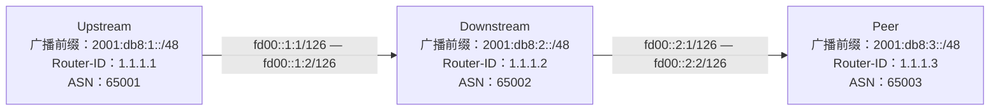

import { Tabs, TabItem, Aside } from "@astrojs/starlight/components";

让我们建立一个 Lab，同时包含三种角色：



# 全部配置

这里我们将一些常量和定义分到了 `utils.conf`，将函数整理到了 `functions.conf`并按照对应机器的 ASN 进行更改，省略 `irr.conf`

<Tabs>
  <TabItem label="utils.conf">

```bird2 {22,52}
roa4 table rpki4;
roa6 table rpki6;


protocol rpki rpki_cloudflare {
    roa4 {
    	table rpki4;
    };
    roa6 {
    	table rpki6;
    };
    remote 172.65.0.2 port 8282;
    retry keep 5;
    refresh keep 30;
    expire 600;
    transport tcp;
}
define BOGON_ASNS = [
    0, # RFC 7607
    23456, # RFC 4893 AS_TRANS
    64496..64511, # RFC 5398 and documentation/example ASNs
#    64512..65534, # RFC 6996 Private ASNs 这里我们注释掉，但你在公网上不行！
    65535, # RFC 7300 Last 16 bit ASN
    65536..65551, # RFC 5398 and documentation/example ASNs
    65552..131071, # RFC IANA reserved ASNs
    4200000000..4294967294, # RFC 6996 Private ASNs
    4294967295 # RFC 7300 Last 32 bit ASN
];
define BOGON_PREFIXES_V4 = [
    0.0.0.0/8+, # RFC 1122 'this' network
    10.0.0.0/8+, # RFC 1918 private space
    100.64.0.0/10+, # RFC 6598 Carrier grade nat space
    127.0.0.0/8+, # RFC 1122 localhost
    169.254.0.0/16+, # RFC 3927 link local
    172.16.0.0/12+, # RFC 1918 private space
    192.0.2.0/24+, # RFC 5737 TEST-NET-1
    192.88.99.0/24{25,32}, # RFC 7526 deprecated 6to4 relay anycast. If you wish to allow this, change `24+` to `24{25,32}`(no more specific)
    192.168.0.0/16+, # RFC 1918 private space
    198.18.0.0/15+, # RFC 2544 benchmarking
    198.51.100.0/24+, # RFC 5737 TEST-NET-2
    203.0.113.0/24+, # RFC 5737 TEST-NET-3
    224.0.0.0/4+ # multicast
];
define BOGON_PREFIXES_V6 = [
    ::/8+, # RFC 4291 IPv4-compatible, loopback, et al
    0064:ff9b::/96+, # RFC 6052 IPv4/IPv6 Translation
    0064:ff9b:1::/48+, # RFC 8215 Local-Use IPv4/IPv6 Translation
    0100::/64+, # RFC 6666 Discard-Only
    2001::/32{33,128}, # RFC 4380 Teredo, no more specific
    2001:2::/48+, # RFC 5180 BMWG
    2001:10::/28+, # RFC 4843 ORCHID
#    2001:db8::/32+, # RFC 3849 documentation 这里我们注释掉，但你在公网上不行！
    2002::/16{17,128}, # RFC 7526 deprecated 6to4 relay anycast. If you wish to allow this, change `16+` to `16{17,128}`(no more specific)
    3ffe::/16+, 5f00::/8+, # RFC 3701 old 6bone
    fc00::/7+, # RFC 4193 unique local unicast
    fe80::/10+, # RFC 4291 link local unicast
    fec0::/10+, # RFC 3879 old site local unicast
    ff00::/8+ # RFC 4291 multicast
];

```

  </TabItem>
  <TabItem label="functions.conf">

```bird2
include "utils.conf";
function net_len_too_long() -> bool {
    case net.type {
        NET_IP4: return net.len > 24; # IPv4 CIDR 大于 /24 为太长
        NET_IP6: return net.len > 48; # IPv6 CIDR 大于 /48 为太长
        else: print "net_len_too_long: unexpected net.type ", net.type, " ", net; return false;
    }
}

function is_not_valid_prefix() -> bool {
    case net.type {
        NET_IP4: return net ~ BOGON_PREFIXES_V4;
        NET_IP6: return net ~ BOGON_PREFIXES_V6;
        else: print "is_not_valid_prefix: unexpected net.type ", net.type, " ", net; return false;
    }
}

function is_not_valid_asn() -> bool {
    if bgp_path ~ BOGON_ASNS then return true;
    return false;
}

function rpki_check() -> bool {
    if ( net.type = NET_IP4 && roa_check(rpki4, net, bgp_path.last) = ROA_INVALID ) then {
        return false;
    }
    else if ( net.type = NET_IP6 && roa_check(rpki6, net, bgp_path.last) = ROA_INVALID ) then {
        return false;
    }
    else {
        return true;
    }
}

include "irr.conf";

function import_filter_upstream() -> bool {
    if net_len_too_long() || is_not_valid_asn() || is_not_valid_prefix() then {
        print net, " invalid prefix, reject";
        return false;
    }
    if !rpki_check() then return false;
    bgp_large_community.add((114514,1,1)); # 添加区分 Community
    bgp_local_pref = 100; # 设置路由优先级为比较靠后
    return true;
}

function export_filter_upstream() -> bool {
    if net_len_too_long() || is_not_valid_asn() || is_not_valid_prefix() then {
        print net, " export invalid prefix, reject";
        return false;
    }
    if bgp_large_community ~ [(114514, 1, 3), (114514, 1, 4)] then return true;
    return false;
}

function import_filter_peer(string s_name) -> bool {
    if net_len_too_long() || is_not_valid_asn() || is_not_valid_prefix() then {
        print net, " invalid prefix, reject";
        return false;
    }
    if !rpki_check() then return false;
    if inet_irr_check(s_name) then {
        bgp_large_community.add((114514,1,2));
        bgp_local_pref = 200;
        return true;
    }
    return false;
}

function export_filter_peer() -> bool {
    if net_len_too_long() || is_not_valid_asn() || is_not_valid_prefix() then {
        print net, " export invalid prefix, reject";
        return false;
    }
    if bgp_large_community ~ [(114514, 1, 3), (114514, 1, 4)] then return true;
    return false;
}

function import_filter_downstream(string s_name) -> bool {
    if net_len_too_long() || is_not_valid_asn() || is_not_valid_prefix() then {
        print net, " invalid prefix, reject";
        return false;
    }
    if !rpki_check() then return false;
    if inet_irr_check(s_name) then {
        bgp_large_community.add((114514,1,4));
        bgp_local_pref = 400;
        return true;
    }
    return false;
}

function export_filter_downstream() -> bool {
    if net_len_too_long() || is_not_valid_asn() || is_not_valid_prefix() then {
        print net, " export invalid prefix, reject";
        return false;
    }
    if bgp_large_community ~ [(114514, 1, 1), (114514, 1, 2), (114514, 1, 3), (114514, 1, 4)] then return true;
    return false;
}

```

</TabItem>

<TabItem label="Upstream bird.conf">

```bird2
include "functions.conf";
log syslog all;
router id 1.1.1.1;
protocol device {
};
protocol kernel {
    ipv6 {
        export all;
    };
};

protocol static static_v6 {
    ipv6;
    route 2001:db8:1::/48 reject {bgp_large_community.add((65001,1,3));};
};

protocol bgp upstream {
    local fd00::1:1 as 65001;
    neighbor fd00::1:2 as 65002;
    direct;
    ipv6 {
        import where import_filter_downstream("AS65001");
        export where export_filter_downstream();
    };
    graceful restart;
};

```

</TabItem>

<TabItem label="Downstream bird.conf">

```bird2
include "functions.conf";
log syslog all;
router id 1.1.1.2;
protocol device {
};
protocol kernel {
    ipv6 {
        export all;
    };
};

protocol static static_v6 {
    ipv6;
    route 2001:db8:2::/48 reject {bgp_large_community.add((65002,1,3));};
};

protocol bgp upstream {
    local fd00::1:2 as 65002;
    neighbor fd00::1:1 as 65001;
    direct;
    ipv6 {
        import where import_filter_upstream();
        export where export_filter_upstream();
    };
    graceful restart;
};
protocol bgp peer {
    local fd00::2:1 as 65002;
    neighbor fd00::2:2 as 65003;
    direct;
    ipv6 {
        import where import_filter_peer("AS65003");
        export where export_filter_peer();
    };
    graceful restart;
};

```

</TabItem>

<TabItem label="Peer bird.conf">

```bird2
include "functions.conf";
log syslog all;
router id 1.1.1.3;
protocol device {
};
protocol kernel {
    ipv6 {
        export all;
    };
};

protocol static static_v6 {
    ipv6;
    route 2001:db8:3::/48 reject {bgp_large_community.add((65003,1,3));};
};

protocol bgp peer {
    local fd00::2:2 as 65003;
    neighbor fd00::2:1 as 65002;
    direct;
    ipv6 {
        import where import_filter_peer("AS65002");
        export where export_filter_peer();
    };
    graceful restart;
};

```

</TabItem>

</Tabs>

# 结果

<Tabs>
  <TabItem label="Upstream">

```shell
root@debian:~# birdc s r
BIRD 2.17.1 ready.
Table master6:
2001:db8:1::/48      unreachable [static_v6 13:08:09.860] * (200)
2001:db8:2::/48      unicast [upstream 13:09:27.800] * (100) [AS65002i]
	via fd00::1:2 on ens3
root@debian:~#
```

  </TabItem>

  <TabItem label="Downstream">

```shell
root@debian:~# birdc s r
BIRD 2.17.1 ready.
Table master6:
2001:db8:1::/48      unicast [upstream 13:09:27.861] * (100) [AS65001i]
	via fd00::1:1 on ens3
2001:db8:2::/48      unreachable [static_v6 13:04:01.157] * (200)
2001:db8:3::/48      unicast [peer 00:46:07.340] * (100) [AS65003i]
	via fd00::2:2 on ens4
root@debian:~#
```

  </TabItem>

  <TabItem label="Peer">

```shell
root@debian:~# birdc s r
BIRD 2.17.1 ready.
Table master6:
2001:db8:2::/48      unicast [peer 00:47:21.551] * (100) [AS65002i]
	via fd00::2:1 on ens3
2001:db8:3::/48      unreachable [static_v6 00:44:32.293] * (200)
root@debian:~#
```

  </TabItem>

</Tabs>

可以看到路由成功地被传递，并且没有泄露。
