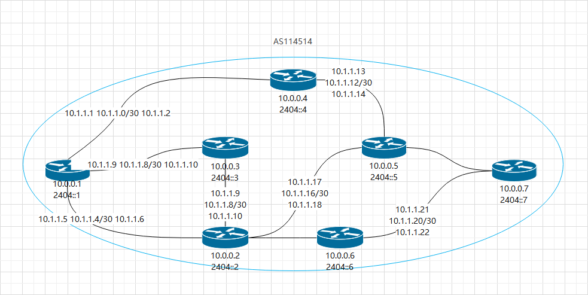

# 阶段2 多地部署

在这篇文章中，我们将讲解多机器时的内网搭建方法和iBGP的配置。

## 开始之前

我们假设：

- 你的ASN是 `AS114514`

- 你有七台机器

  1. 10.0.0.1 2404::1 fe80::1 边界节点 广播2404:1::/48
  2. 10.0.0.2 2404::2 fe80::2 内网节点
  3. 10.0.0.3 2404::3 fe80::3 内网节点
  4. 10.0.0.4 2404::4  fe80::4 边界节点 广播2404:2::/48
  5. 10.0.0.5 2404::5 fe80::5 内网节点
  6. 10.0.0.6 2404::6 fe80::6 内网节点
  7. 10.0.0.7 2404::7 fe80::7 边界节点 广播2404:3::/48

  fe80开头的为`Link Local IPv6`

  如下所示，其中黑色直线代表有链路存在，蓝色椭圆代表AS114514这个自治系统

**该设置将通用于本篇教程**

## 介绍

经过了一段时间的发展，你现在已经有七个节点，现在你想为他们做一个内网。

在内网中，我们需要使用IGP跟iBGP协议。

### 基础概念介绍

- IGP（全称Interior Gateway Protocol），即在AS**内部**使用的路由协议。用来管理内网路由。

  常见的IGP协议有：`OSPF`，`babel`，`ISIS`。其中我们将主要讲解`OSPF`。

- iBGP（全称Interior BGP），是将路由在边界路由器**之间**传递路由的方式，用来管理多地的公网路由。
- 链路，通俗来说，指的是一条二层可达的连接，比如使用网线连接。隧道是一种特殊的链路。
- Link Local IPv6，缩写`LL IPv6`或`IPv6 LL`，用于链路之上的IPv6，仅在同一链路内有效。在本篇文章中，我们使用LL IPv6来简化链路之间的连接。

### IGP跟iBGP的区别和应用

当年我看完这两套协议后，十分不解：这两个协议的区别在哪？该如何应用？所以，我们来单独讲一下它们的区别。

IGP的主要应用在于自治系统内的内网路由的传递。如上图中示例，则IGP是用来管理10.0.0.1-10.0.0.7这一段IP的传递。

iBGP的主要应用在于自治系统的边界路由器之间外部路由传递。如上图中示例，则iBGP用来在10.0.0.1 10.0.0.4 10.0.0.7之间传递各自的广播段和外部BGP收到的段。

### full mesh

full mesh是一种连接形式，即所有节点之间全部两两直接连接。

在内网搭建中，有不少人会搞混BGP full mesh与tunnel full mesh。

iBGP为了防止环路，所以每个路由仅会传递给他的直接邻居，不会传递给邻居的邻居，也就是说边界路由器之间需要两两连接以保证路由可以传递到每一个边界路由器，这就是BGP full mesh。

而让边界路由器之间能够直接连接，最直接而最简单的方法就是让网络full mesh，也就是tunnel full mesh。但当网络内节点变得多的时候，这种连接方式就会变得费时费力，难以维护，易出错。为了简化连接，我们就需要使用IGP来代替tunnel full mesh并达到full mesh的效果，即网络内所有设备都能联通。

## IGP配置

### OSPF

### Babel

## iBGP 配置

### iBGP Full mesh

### iBGP RR

### iBGP Confederation

