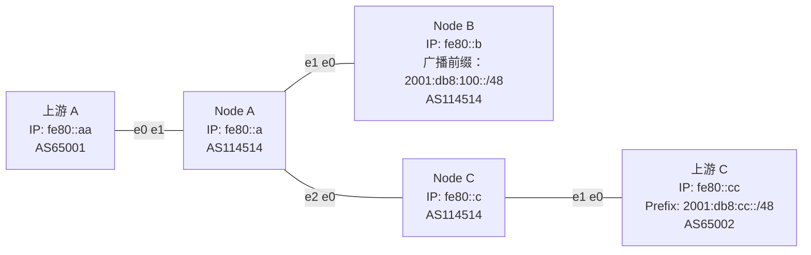

import { Aside, Tabs, TabItem } from "@astrojs/starlight/components";

假设你有三台 VPS，其中两台已建立 BGP 会话，如下图所示。你希望在没有 BGP 会话的那台 VPS 上提供服务，并通过两台已有会话的 VPS 对外发布该服务的路由。你当然希望用户能从距离最近的节点访问服务，也就是说，需要将两份 BGP 全表合并后综合判断路由，但同时对外 AS 又不变。这种需求可以通过一种机制来实现：iBGP。



# iBGP

iBGP（Internal BGP 或 Interior BGP）是指在同一个自治系统（AS）内部建立的 BGP 会话。它与 eBGP（External BGP）相比，有以下三点主要区别：

1. **管理距离不同**。在 BIRD 中，eBGP 的管理距离为 20，OSPF 是 110，而 iBGP 是 200。这意味着当一条路由同时从 eBGP 和 iBGP 学到时，路由器会优先选择 eBGP 的路径，从而有效避免路由环路。而且对于大多数场景来说，越早将流量引出本地网络越好。
2. **下一跳处理不同**。eBGP 默认会将下一跳地址修改为本机，而 iBGP 默认保留原有的下一跳地址。因此，我们通常会在将 eBGP 学到的路由传给 iBGP 时手动将下一跳设置为本地地址，以避免在 IGP 中传播不必要的外部路由（这也是 IX 要求使用不广播的公网 IP 地址的原因之一）。
3. **环路防护机制不同**。eBGP 通过 AS Path 来检测和防止环路，而 iBGP 由于自治系统号相同，不会在 AS Path 中增加自己的 ASN（否则你就会看到一条路由中同一个 ASN 重复十几次）。因此，iBGP 采用**水平分割（split horizon）**机制：**一般情况下，不会将从一个 iBGP 对等体学到的路由转发给另一个 iBGP 对等体**。

# 配置方式

由于 iBGP 的水平分割机制，无法像 eBGP 那样“一配即通”。为了确保所有节点能接收到完整路由信息，需要将所有 iBGP 节点以特定方式互联。常见方式有：

- Full Mesh（全连接）
- Route Reflector（路由反射器）
- Confederation（联盟）

其中 Confederation 由于现网案例少、问题多，我们不在这里讲述（TODO）。

## Full Mesh（全连接）

理解了 iBGP 的防环机制，我们最直接的做法就是：把它们全部连起来！这种方式称为 Full Mesh，适用于节点数量较少的情况。以下是一个简单配置示例：

```bird2
protocol bgp bgp_ipeer {
    local fe80::a as 114514;
    neighbor fe80::c%e2 as 114514;
    direct;
    ipv6 {
        import all;
        export all;
    };
    graceful restart;
}
```

由于 iBGP 没有上下游角色限制，因此可以放心地使用 `import all` 和 `export all`。

## Route Reflector（路由反射器）

Full Mesh 在少量的时候配起来是很简单的，但当节点数量增多时，Full Mesh 会面临连接数量爆炸的问题。有的工程师就想：既然我的目的是防环，那我可以让一个专门的中心节点来管理路由，只让它来发不就好了。秉承着这种想法，Route Reflector（路由反射器，简称 RR）诞生了。Route Reflector 是一台经过特殊配置的路由器，按照如下规则转发路由：

1. 从非 RR Client 学到的路由，可转发给所有 RR Client；
2. 从 RR Client 学到的路由，可转发给所有非 RR Client 和其他 RR Client（不含原始发起者）；
3. 从 eBGP 对等体学到的路由，可转发给所有 RR Client 和非 Client。

为了防止环路，RR 在转发路由时会添加 `Originator ID` 和 `Cluster List`：

- `Originator ID`：标记原始路由发起者（即 RR Client）的 Router ID，当原始路由该项为空时写发起者的 Router ID；
- `Cluster List`：RR 会在其中添加自己的 Router ID，若路由再次经过自身，则拒收，防止回环。

依靠这两个属性，RR 成功实现了跟其他节点的防环。从整体来看，一个 RR 及其所有的 RR Client 就像花瓣一样组成了一个集群，可以把它“看作”是一个大的 iBGP 节点，并继续向上组网，形成分级 RR 结构。

<Aside type="tip">
  如果两个 RR 管理的是不同集群，Cluster ID
  应不同；若互为备份、共同服务于同一集群，则 Cluster ID 应一致。
</Aside>

示例配置如下：

<Tabs>
  <TabItem label="RR">

```bird2 {9}
protocol bgp bgp_ipeer_c {
    local fe80::a as 114514;
    neighbor fe80::c%e2 as 114514;
    direct;
    ipv6 {
        import all;
        export all;
    };
    rr client;
    graceful restart;
}

```

  </TabItem>
  <TabItem label="RR Client">

```bird2
protocol bgp bgp_ipeer_rr {
    local fe80::c as 114514;
    neighbor fe80::a%e0 as 114514;
    direct;
    ipv6 {
        import all;
        export all;
    };
    graceful restart;
}

```

  </TabItem>
</Tabs>

可以看到，RR 端需要在对 Client 的连接中添加 `rr client;`，而 Client 无需额外配置。

# 模板

如果说 eBGP 配置是“千人千面”，那么 iBGP 的配置可以说是“高度统一”。尤其在配置多个 RR Client 时，很多参数都是重复的。这种场景下，**模板机制**（template）就显得非常有用。

让我们举个例子：

<Tabs>

<TabItem label="用模板">

```bird2
template bgp ibgp {
	direct;
    ipv6 {
        import all;
        export all;
    };
    rr client;
    graceful restart;
}

protocol bgp node_b from ibgp {
    local fe80::a as 114514;
    neighbor fe80::b%e1 as 114514;
}

protocol bgp node_c from ibgp {
    local fe80::a as 114514;
    neighbor fe80::c%e2 as 114514;
}
```

</TabItem>

<TabItem label="不用模板">

```bird2
protocol bgp node_b from ibgp {
    local fe80::a as 114514;
    neighbor fe80::b%e1 as 114514;
    direct;
    ipv6 {
        import all;
        export all;
    };
    rr client;
    graceful restart;
}

protocol bgp node_c from ibgp {
    local fe80::a as 114514;
    neighbor fe80::c%e2 as 114514;
    direct;
    ipv6 {
        import all;
        export all;
    };
    rr client;
    graceful restart;
}
```

</TabItem>

</Tabs>

可以看到，使用模板显著减少了重复代码，配置更清晰，也更易维护。
