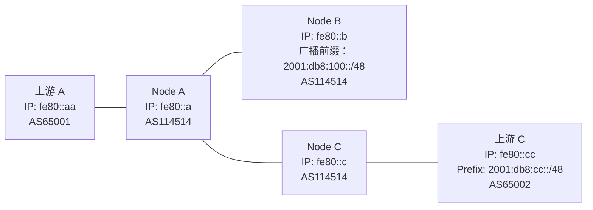

假设你有三台 VPS，其中有两台 VPS 有 BGP Session，如下图所示你希望在没有 BGP Session 的 VPS 上提供一个服务，并且通过两个 BGP Session 对外公布。你肯定会希望能够哪个 VPS 近就从哪个 VPS 进出，这就意味着你需要把两份 BGP 全表放在一起来综合考虑。有一种方法，叫 iBGP，就可以解决这个问题。



# iBGP

iBGP（Internal/Interior BGP），指的是相同 AS 之间的 BGP。iBGP 跟 eBGP 有如下三点不同：

1. 管理距离不同。在 BIRD 中，eBGP 的管理距离是 20，OSPF 是 110，而 iBGP 是 200。这意味着，如果相同的一条路由从 iBGP 和 eBGP 进来，路由器会优先选 eBGP 的，从而防止环路。而且，对大部分路由器而言，及早把包交出去比在自己内网里打转要好。
2. 下一跳行为不同。iBGP 默认不修改下一跳为自己，而 eBGP 会修改下一跳为自己。但我们一般会把从 eBGP 收到、向 iBGP 广播的路由的下一跳改为自己，从而减少 IGP 内的路由数量。
3. 防环方式不同。eBGP 的防环靠的是 AS Path，而 iBGP 因为 AS 相同所以不会在 AS Path 内增加 ASN（否则你就会看到一些路由有十几个相同 AS 在 AS Path 中），因此，iBGP 的防环靠的是，不把从 iBGP 收到的路由发向另一个 iBGP 连接，这也被称为**水平分割**机制。

# 配置方式

由于 iBGP 有水平分割机制，所以我们不能像 eBGP 一样一配了之，而是需要将所有的 iBGP 节点用某种特定的方式连接在一起，才能让路由正常传递。常见的配置方式有这几种：Full Mesh, Route Reflector, Confederation。其中 Confederation 由于现网案例少、问题多，我们不在这里讲述。

## Full Mesh（全连接）

看到 iBGP 的防环机制，我们最容易想到的方法是：把它们全部连起来！这种方法被称为 Full Mesh，在数量少的时候很好用。让我们来一个示例配置：

```bird2
protocol bgp bgp_ipeer {
    local fe80::a as 114514;
    neighbor fe80::c%e1 as 114514;
    multihop 2;
    ipv6 {
        import all;
        export all;
    };
    graceful restart;
}
```

iBGP 没有上下游这么多的限制，所以直接 import all, export all 就好。

## Route Reflector（路由反射器）

## 全部配置

## 验证

# 后续
