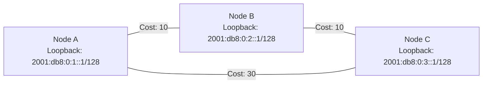
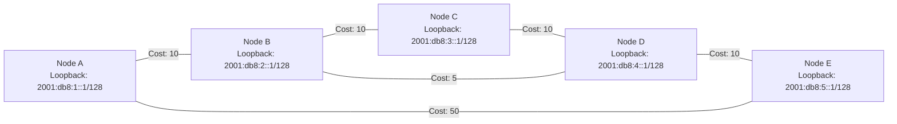
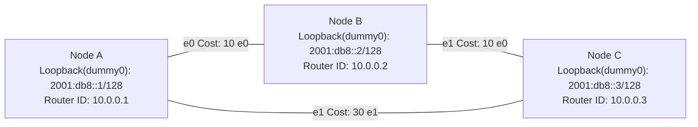

import { Aside, Tabs, TabItem } from "@astrojs/starlight/components";

让我们先来看一个情景：



问题是：从 A 到 C 的最小开销路径是哪一条？

你很可能会毫不犹豫地回答：经由 B 再到 C！这看起来毫无难度。

但如果我们面对的是下面这种情况呢？



现在计算起来还容易吗？更进一步，如果 cost 是动态变化的呢？你难道要 24 小时守着配置器随时手动调整吗？

聪明的工程师显然不会允许自己日夜值班，于是他们发明了 IGP。

# 概念介绍

## IGP

以下引自[维基百科](https://zh.wikipedia.org/wiki/%E5%86%85%E9%83%A8%E7%BD%91%E5%85%B3%E5%8D%8F%E8%AE%AE)：

> **内部网关协议**（英语：Interior Gateway Protocol，缩写为 IGP）是指在一个[自治系统](https://zh.wikipedia.org/wiki/自治系统)（AS）内部所使用的一种[路由协议](https://zh.wikipedia.org/wiki/路由协议)。
>
> 与此相对，[外部网关协议](https://zh.wikipedia.org/wiki/外部网关协议)用来在自治系统之间确定网络可达性、并通过内部网关协议来解析某个自治系统内部的路由。

通俗来说，BGP 决定了自治系统之间如何通信，而 IGP 决定了自治系统内部的路径选择。

<Aside type="note">
  严格说来，IGP 的对立面是 EGP，但目前 EGP 几乎只有 BGP
  在广泛使用，因此我们做此简化。
</Aside>

IGP 可分为三种：

**IGP（Interior Gateway Protocol，内部网关协议）可大致分为三类：**

1. **距离向量路由协议（Distance Vector Protocol）** 这类协议的特点是每个路由器只把自己知道的路由信息和距离（通常以跳数计）告诉相邻的路由器，路由器之间彼此交换信息，靠不断更新来找到最短路径。典型代表是 **RIP（Routing Information Protocol）**。RIP 配置简单，但扩展性差，收敛速度慢，适用于小型、简单网络。相比之下，**Babel** 是近年来较为流行的现代化距离向量协议，发布于 2021 年，虽然本质上也属于距离向量算法，但它在度量方式、环路避免和链路检测上做了很多改进，支持同时处理 IPv4 和 IPv6，并且非常适合动态变化的网络环境，比如无线 Mesh、流动性高的 VPS 组网等。
2. **链路状态路由协议（Link State Protocol）**这类协议要求每台路由器收集整个网络的拓扑信息，然后使用如 Dijkstra 算法计算最短路径，特点是收敛快、可扩展性强，适合中大型网络。典型代表是 **OSPF（Open Shortest Path First）** 和 **IS-IS（Intermediate System to Intermediate System）**。OSPF 是目前最常见的开源 IGP，分区域设计、支持认证和多路径，适用于复杂场景。ISIS 则常用在运营商的内网中，因为其扩展性高，适用于 MPLS 等需要携带更多信息的内网需求。
3. **混合路由协议（Hybrid Protocol）** 顾名思义，这类协议融合了前两种的优点，比如同时使用邻居交换和拓扑更新机制。典型代表是 **EIGRP（Enhanced Interior Gateway Routing Protocol）**，是思科私有协议。EIGRP 结合了距离向量的简单和链路状态的快速收敛，但因专有性质较少使用。

RIP 太过时，EIGRP 太封闭，ISIS 需要 L2 连接，因此我们的选项仅有 OSPF 和 Babel。但考虑到 Babel 的时间较短，应用不够广泛，本节将只讲 OSPF，Babel 的讲解将在后面扩展中提到。（TODO）

## OSPF

> OSPF（Open Shortest Path First，开放式最短路径优先）是是大中型网络上使用较为广泛的[IGP](https://zh.wikipedia.org/wiki/内部网关协议)协议。OSPF 是对[链路状态路由协议](https://zh.wikipedia.org/w/index.php?title=链路状态路由协议&action=edit&redlink=1)的一种实现，运作于[自治系统](https://zh.wikipedia.org/wiki/自治系统)内部。OSPF 分为 OSPFv2 和 OSPFv3 两个版本：OSPFv2 定义于 RFC 2328（1998），支持[IPv4](https://zh.wikipedia.org/wiki/IPv4)网络；而 OSPFv3 定义于 RFC 5340（2008），支持[IPv6](https://zh.wikipedia.org/wiki/IPv6)网络。
>
> OSPF 提出了“区域（Area）”的概念，一个网络可以由单一区域或者多个区域组成。其中，一个特别的区域被称为骨干区域（Backbone Area），该区域是整个 OSPF 网络的核心区域，并且所有其他的区域都与之直接连接。所有的内部路由都通过骨干区域传递到其他非骨干区域。所有的区域都必须直接连接到骨干区域，如果不能建立直接连接，那么可以通过[虚链路](https://zh.wikipedia.org/w/index.php?title=虚链路&action=edit&redlink=1)（virtual link）和骨干区域建立[虚拟连接](https://zh.wikipedia.org/w/index.php?title=虚拟连接&action=edit&redlink=1)。
>
> 它使用链路状态数据库（LSDB）用来保存当前[网络拓扑](https://zh.wikipedia.org/wiki/网络拓扑)结构，[路由器](https://zh.wikipedia.org/wiki/路由器)上属于同一区域的链路状态数据库是相同的（属于多个区域的路由器会为每个区域维护一份链路状态数据库）。
>
> 同一个[广播域](https://zh.wikipedia.org/wiki/广播域)（Broadcast Domain）的[路由器](https://zh.wikipedia.org/wiki/路由器)或者一个[点对点](https://zh.wikipedia.org/wiki/点对点)（Point To Point）连接的两端的路由器，在发现彼此的时候，建立邻接（Adjacencies）[[注 1\]](https://zh.wikipedia.org/wiki/开放式最短路径优先#cite_note-1)。多路访问网络以及非广播多路访问网络的路由器会选举指定路由器（Designated Router, DR）和备份指定路由器（Backup Designated Router, BDR），DR 和 BDR 作为网络的中心负责路由器之间的信息交换从而降低了网络中的信息流量。OSPF 协议同时使用[单播](https://zh.wikipedia.org/wiki/單播)（Unicast）和[群播](https://zh.wikipedia.org/wiki/組播)（Multicast）来发送[Hello 包](https://zh.wikipedia.org/w/index.php?title=Hello包&action=edit&redlink=1)和链路状态更新（Link State Updates），使用的群播[地址](https://zh.wikipedia.org/wiki/IP地址)为 224.0.0.5 和 224.0.0.6。与[RIP](https://zh.wikipedia.org/wiki/路由信息协议)和[BGP](https://zh.wikipedia.org/wiki/BGP)不同的是，OSPF 协议不使用 TCP 或者 UDP 协议而是直接承载在 IP 协议之上，[IP 协议号](https://zh.wikipedia.org/wiki/IP协议号列表)为 89。

在小型网络中，我们可以只使用一个骨干区域，不需要了解 DR、BDR、ASBR 等复杂机制。OSPF 分为 v2、v3 两个版本， 其中 v2 仅支持 IPv4，v3 支持 IPv4 和 IPv6，由于我们是 IPv6 内网，所以直接使用 OSPFv3 就可以。因为 IPv6 自带了 link-local 地址，所以 OSPFv3 不需要配置 IP 就可以使用，更加方便。

<Aside type="note">
  虽然 OSPFv3 可基于 link-local 地址自动运行，但接口必须先启用才能生成地址！
</Aside>

需要注意的是，在大部分路由系统中，OSPFv3 都需要分两个实例来分别跑 IPv4、IPv6 并独立计算 LSDB，因此实际操作中经常是 IPv6 起一个 OSPFv3，IPv4 起一个 OSPFv2（现在你应该知道为什么运营商不喜欢配双栈了）。OSPFv2 将在之后讲解（TODO），但通常而言，只需要你把`v3`改成`v2`就好了。

# 配置



以上图为例。

## 单个配置

以 Node A 举例：

```bird2
protocol ospf v3 ospfv3 {
    ipv6;
    area 0 {
        interface "e0" {
            cost 10;
            type ptp;
        }
        interface "e1" {
            cost 30;
            type ptp;
        }
        interface "dummy0" {
            stub;
        }
    };
}
```

其中：

```bird2 startLineNumber=1 "v3"
protocol ospf v3 ospfv3 {
```

中的 `v3` 是版本号，省略掉或者改成 `v2` 就是 OSPFv2

```bird2 startLineNumber=3 "0"
	area 0 {
```

中的 `0` 是区域，可以用点分十进制 32 位数字（像 Router ID 一样）或者直接用数字，0 区域是骨干区域，在一个 OSPF 网络中所有区域必须与 0 区域有连接。

```bird2 startLineNumber=4
		interface "e0" {
```

中的 `e0` 是加入 OSPF 网络的接口。OSPF 是链路状态协议，交换的东西是链路状态，因此加入的是接口而不是路由，路由是依托于接口而存在的。

```bird2 startLineNumber=5
			cost 10;
```

这个`cost`是这个接口到对面所用的开销，在 BIRD 中默认是 10。

商业路由器的计算公式是：

$$
\text{Cost} = \frac{\text{参考带宽}}{\text{接口带宽}}
$$

其中参考带宽为 100Mbps，Cost 小于 1 时取 1。

而我们通常会用到的就是将延迟转化为整数（例如 x100），因为延迟通常比带宽更重要。你也可以根据自己的需要微调 cost。

```bird2 startLineNumber=6
            type ptp;
```

这里的类型有 `broadcast/bcast`、`pointopoint/ptp`、`nonbroadcast/nbma`和`pointomultipoint/ptmp`几种，介绍让我们摘录一下 BIRD 的原文：

> - `type broadcast|bcast`
>   BIRD 会自动检测已连接网络的类型，但有时手动强制使用不同类型会更方便。在广播网络（如以太网）中，泛洪和 Hello 消息通过多播发送（对所有邻居发送单个数据包）。会选举一个指定路由器，该路由器负责同步链路状态数据库并生成网络 LSA。此网络类型不能用于物理 NBMA 网络和无编号网络（没有适当 IP 前缀的网络）。
> - `type pointopoint|ptp`
>   点对点网络仅连接两个路由器。不会进行选举，也不会生成网络 LSA，这使得建立过程更简单、更快速。此网络类型不仅适用于物理点对点接口（如 PPP 或隧道），也适用于作为点对点链路使用的广播网络。此网络类型不能用于物理 NBMA 网络。
>
> - `type nonbroadcast|nbma`
>   在 NBMA 网络中，由于缺乏多播功能，数据包会分别发送给每个邻居。与广播网络类似，会选举一个指定路由器，该路由器在 LSA 的传播中起核心作用。此网络类型不能用于无编号网络。
>
> - `type pointomultipoint|ptmp`
>   这是另一种设计用于处理 NBMA 网络的网络类型。在这种情况下，NBMA 网络被视为一组点对点（PtP）链路。如果 NBMA 网络上的每对路由器之间没有直接通信，或者 NBMA 网络被用作（可能是无编号的）点对点链路，这种方式非常有用。

简述而言，就是前两者会通过`ff02::5`地址发送广播包来发现邻居，后二者需要手动配置邻居。如果你在一个实体网络内，可以用第一个；通常我们用 Wireguard 或者点对点链路（插线）会用第二个。

<Aside title="tip">
  1. 在 Wireguard 上使用的时候，最好使用 `ptp` 或 `ptmp`。 2. 在 BIRD 与
  Mikrotik 通过 Wireguard 进行配对的时候，请尽量使用
  `ptp`，有传言说这两个软件发送的 `ptmp` 包不相同。
</Aside>
细心的你会发现，我们在这里直接 `ipv6;` 而不是配置 `import` 和 `export`，这是因为我们并不需要用它来传递外部路由，只需要传递本地地址——而这已经够我们接下来起
iBGP 的需求。如果你需要用 OSPF 传输比如静态路由，那你还需要把`import`和`export`配好。

或许你会问：既然我们没有导入路由，那我们怎么传递在`dummy`接口上的地址呢？答案很简单：既然它是个接口，那我们就把它加进 OSPF 就好了。不过，既然`dummy`接口是个虚拟接口，并没有实际的连接，那我们就要配置 BIRD 不在这个接口发送 OSPF 包，方法是把它配置成`stub`接口，在别的路由器里也可能是把它配置成`passive`，如下所示：

```bird2 {2} startLineNumber=12
        interface "dummy0" {
            stub; # 这里将其配置成 stub 接口
        }
```

你可能会问：那为什么我不把它当成外部路由导入，而是把它当成接口加入呢？一方面，内部路由比外部路由优先级更高；另外一方面，这样能减少 Type5 LSA，提高 OSPF 效率（Type 5 LSA 会穿过汇总边界，对于性能低的 OSPF 设备不利）。

## 全部配置

让我们把三个机器配满，来看看效果：

<Tabs syncKey="Node">

<TabItem label="Node A">

```bird2
log syslog all;
router id 10.0.0.1; # 定义 Router ID

protocol device {
};

protocol kernel {
    ipv6 {
    	export all;
    };
};

protocol ospf v3 ospfv3 {
    ipv6;
    area 0 { # 我们只用 area0，设备不多没必要分 area
        interface "e0" {
            cost 10;
            type ptp;
        };
        interface "e1" {
            cost 30;
            type ptp;
        };
        interface "dummy0" {
            stub;
        };
    };
}
```

</TabItem>

<TabItem label="Node B">

```bird2
log syslog all;
router id 10.0.0.2;

protocol device {
};

protocol kernel {
    ipv6 {
    	export all;
    };
};

protocol ospf v3 ospfv3 {
    ipv6;
    area 0 {
        interface "e0" {
            cost 10;
            type ptp;
        };
        interface "e1" {
            cost 10;
            type ptp;
        };
        interface "dummy0" {
            stub;
        };
    };
}
```

</TabItem>

<TabItem label="Node C">

```bird2
log syslog all;
router id 10.0.0.3;

protocol device {
};

protocol kernel {
    ipv6 {
    	export all;
    };
};

protocol ospf v3 ospfv3 {
    ipv6;
    area 0 {
        interface "e0" {
            cost 10;
            type ptp;
        };
        interface "e1" {
            cost 30;
            type ptp;
        };
        interface "dummy0" {
            stub;
        };
    };
}
```

</TabItem>

</Tabs>

## 验证

我们可以通过`birdc show ospf state`和`birdc show route`来验证是否成功搭建。

<Tabs syncKey="Node">

<TabItem label="Node A">

state:

```shell
root@debian:~# birdc show ospf state
BIRD 2.17.1 ready.

area 0.0.0.0

    router 10.0.0.1
        distance 0
        router 10.0.0.2 metric 10
        router 10.0.0.3 metric 30
        stubnet 2001:db8::1/128 metric 0

    router 10.0.0.2
        distance 10
        router 10.0.0.1 metric 10
        router 10.0.0.3 metric 10
        stubnet 2001:db8::2/128 metric 0

    router 10.0.0.3
        distance 20
        router 10.0.0.2 metric 10
        router 10.0.0.1 metric 30
        stubnet 2001:db8::3/128 metric 0
root@debian:~#
```

route:

```shell
root@debian:~# birdc show route
BIRD 2.17.1 ready.
Table master6:
2001:db8::2/128      unicast [ospfv3 2025-07-11] * I (150/10) [10.0.0.2]
	via fe80::5220:deff:fe00:100 on ens3
2001:db8::3/128      unicast [ospfv3 2025-07-11] * I (150/20) [10.0.0.3]
	via fe80::5220:deff:fe00:100 on ens3
2001:db8::1/128      unicast [ospfv3 2025-07-11] * I (150/0) [10.0.0.1]
	dev dummy0
root@debian:~#
```

</TabItem>

<TabItem label="Node B">

state:

```shell
root@debian:~# birdc show ospf state
BIRD 2.17.1 ready.

area 0.0.0.0

    router 10.0.0.1
        distance 0
        router 10.0.0.2 metric 10
        router 10.0.0.3 metric 30
        stubnet 2001:db8::1/128 metric 0

    router 10.0.0.2
        distance 10
        router 10.0.0.1 metric 10
        router 10.0.0.3 metric 10
        stubnet 2001:db8::2/128 metric 0

    router 10.0.0.3
        distance 20
        router 10.0.0.2 metric 10
        router 10.0.0.1 metric 30
        stubnet 2001:db8::3/128 metric 0
root@debian:~#
```

route:

```shell
root@debian:~# birdc show route
BIRD 2.17.1 ready.
Table master6:
2001:db8::2/128      unicast [ospfv3 2025-07-11] * I (150/0) [10.0.0.2]
	dev dummy0
2001:db8::3/128      unicast [ospfv3 2025-07-11] * I (150/10) [10.0.0.3]
	via fe80::5288:acff:fe00:200 on ens4
2001:db8::1/128      unicast [ospfv3 2025-07-11] * I (150/10) [10.0.0.1]
	via fe80::5215:b5ff:fe00:300 on ens3
root@debian:~#
```

</TabItem>

<TabItem label="Node C">

state:

```shell
root@debian:~# birdc show ospf state
BIRD 2.17.1 ready.

area 0.0.0.0

    router 10.0.0.1
        distance 0
        router 10.0.0.2 metric 10
        router 10.0.0.3 metric 30
        stubnet 2001:db8::1/128 metric 0

    router 10.0.0.2
        distance 10
        router 10.0.0.1 metric 10
        router 10.0.0.3 metric 10
        stubnet 2001:db8::2/128 metric 0

    router 10.0.0.3
        distance 20
        router 10.0.0.2 metric 10
        router 10.0.0.1 metric 30
        stubnet 2001:db8::3/128 metric 0
root@debian:~#
```

route:

```shell
root@debian:~# birdc show route
BIRD 2.17.1 ready.
Table master6:
2001:db8::2/128      unicast [ospfv3 2025-07-11] * I (150/10) [10.0.0.2]
	via fe80::5220:deff:fe00:101 on ens3
2001:db8::3/128      unicast [ospfv3 2025-07-11] * I (150/0) [10.0.0.3]
	dev dummy0
2001:db8::1/128      unicast [ospfv3 2025-07-11] * I (150/20) [10.0.0.1]
	via fe80::5220:deff:fe00:101 on ens3
root@debian:~#
```

</TabItem>

</Tabs>

可以看到，我们成功通过 OSPF 传递了路由。并且你可以发现，在完全同步的 OSPF 区域内部，所有机器拿到的 area 信息是完全一样的。

# 附录：OSPF 的常见问题

OSPF 是一个有很多要求的协议，这里梳理出一些常见问题给大家：

1. Wireguard 上建议使用 `ptp` 类型，尤其对端为 Mikrotik 时，使用 `ptmp` 可能存在兼容性问题。
2. 七个一样
   - MTU 必须一样
   - 区域类型必须一样
   - 区域号必须一样
   - 链路类型必须一样
   - 网段必须一样
   - hello/dead 时间必须一样
   - 认证必须一样
