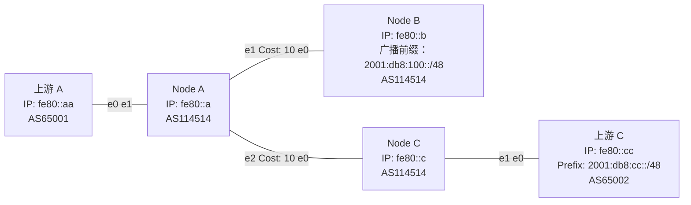

现在让我们建立一个Lab，使用我们前面学到的 IGP 和 iBGP，拓扑如下所示：

细心的你应该能看到我们这里用的IP是我们的回环IP，这里我们有一个小贴士：一般在有IGP的环境下起iBGP的时候，我们会选择用回环地址起iBGP，这样子当两者之间的内网路径有变动的时候，IGP能帮我们进行收敛，从而实现协议的分层。当然，这是当两个节点之间有多个节点进行转发的时候的操作方法，我们一般也用不到。

# 配置

## IGP

## eBGP

## iBGP

## 全部配置

## 验证

# 后续

或许你会问：如果我们的网络节点很多，两个有BGP 会话的节点不是直连而是要通过中间节点转发，那我该怎么做呢？在目前的环境中，你可以用RR让中间的节点也拿到BGP表，从而实现转发。但假如中间的节点内存比较小，装不下表怎么办？那就得使用一种叫MPLS的技术了。

由于MPLS技术已经涉及到一些高级知识，所以在我们的新手教学不会进行讲解（TODO），有兴趣的同学可以自己去搜，~~或者等我把高级教程咕咕咕出来~~。
