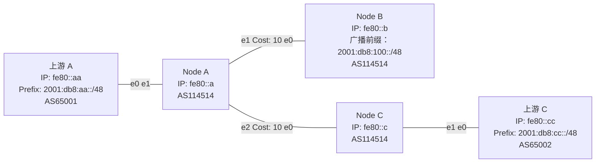

import { Aside, Tabs, TabItem } from "@astrojs/starlight/components";

现在让我们建立一个Lab，使用我们前面学到的 IGP 和 iBGP，拓扑如下所示：




细心的你应该能看到我们这里用的IP是我们的回环IP，这里有一个最佳实践：一般在有IGP的环境下起iBGP的时候，最好用回环地址起iBGP，这样子当两者之间的内网路径有变动的时候，IGP能帮我们进行收敛，从而实现协议的分层。当然，这是当两个节点之间有多个节点进行转发的时候的操作方法，我们一般也用不到，因此如果想用PtP起也是可以的。

这里我们采用RR配法，以Node A作为RR。`functions.conf`等沿用[之前的内容](/beginner/connect-with-others/lab)，这里不再赘述。

# 配置

## IGP

<Tabs syncKey="node">

<TabItem label="Node A">

```bird2
protocol ospf v3 ospfv3 {
    ipv6;
    area 0 {
        interface "e1" {
            cost 10;
            type ptp;
        }
        interface "e2" {
            cost 10;
            type ptp;
        }
        interface "dummy0" {
            stub;
        }
    };
}
```

</TabItem>

<TabItem label="Node B">

```bird2
protocol ospf v3 ospfv3 {
    ipv6;
    area 0 {
        interface "e0" {
            cost 10;
            type ptp;
        }
        interface "dummy0" {
            stub;
        }
    };
}
```

</TabItem>

<TabItem label="Node C">

```bird2
protocol ospf v3 ospfv3 {
    ipv6;
    area 0 {
        interface "e0" {
            cost 10;
            type ptp;
        }
        interface "dummy0" {
            stub;
        }
    };
}
```

</TabItem>

</Tabs>

## eBGP

<Tabs syncKey="node">

<TabItem label="Node A">

```bird2

```

</TabItem>

<TabItem label="Node C">

```bird2

```

</TabItem>

</Tabs>

## iBGP

<Tabs syncKey="node">

<TabItem label="Node A">

```bird2

```

</TabItem>

<TabItem label="Node B">

```bird2

```

</TabItem>

<TabItem label="Node C">

```bird2

```

</TabItem>

</Tabs>

## 全部配置

<Tabs syncKey="node">

<TabItem label="Node A">

```bird2
include "functions.conf";
log syslog all;
router id 1.1.1.1;
protocol device {
};

protocol kernel {
    ipv6 {
        export all;
    };
};

protocol ospf v3 ospfv3 {
    ipv6;
    area 0 {
        interface "e1" {
            cost 10;
            type ptp;
        }
        interface "e2" {
            cost 10;
            type ptp;
        }
        interface "dummy0" {
            stub;
        }
    };
}

protocol bgp upstream {
    local fd00::1:2 as 65002;
    neighbor fd00::1:1 as 65001;
    direct;
    ipv6 {
        import where import_filter_upstream();
        export where export_filter_upstream();
    };
    graceful restart;
};

protocol bgp node_b {
    local fd00::2:1 as 65002;
    neighbor fd00::2:2 as 65003;
    direct;
    ipv6 {
        import where import_filter_peer("AS65003");
        export where export_filter_peer();
    };
    graceful restart;
};

protocol bgp node_c {
    local fd00::2:1 as 65002;
    neighbor fd00::2:2 as 65003;
    direct;
    ipv6 {
        import all;
        export all;
    };
    graceful restart;
};

```

</TabItem>

<TabItem label="Node B">

```bird2

```

</TabItem>

<TabItem label="Node C">

```bird2

```

</TabItem>

</Tabs>

## 验证


# 后续

或许你会问：如果我们的网络节点很多，两个有BGP 会话的节点不是直连而是要通过中间节点转发，那我该怎么做呢？在目前的环境中，你可以用RR让中间的节点也拿到BGP表，从而实现转发。但假如中间的节点内存比较小，装不下表怎么办？那就得使用一种叫MPLS的技术了。

由于MPLS技术已经涉及到一些高级知识，所以在我们的新手教学不会进行讲解（TODO），有兴趣的同学可以自己去搜，~~或者等我把高级教程咕咕咕出来~~。
