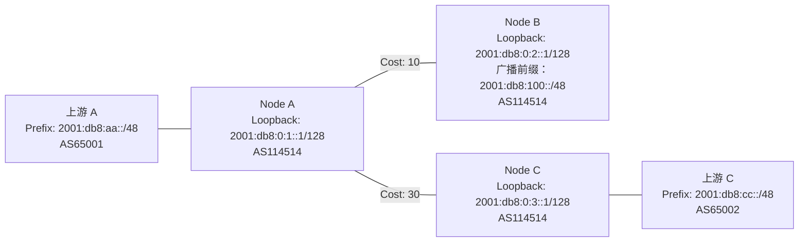

TODO

细心的你应该能看到我们这里用的IP是我们的回环IP，这里我们有一个小贴士：一般在有IGP的环境下起iBGP的时候，我们会选择用回环地址起iBGP，这样子当两者之间的内网路径有变动的时候，IGP能帮我们进行收敛，从而实现协议的分层。当然，这是当两个节点之间有多个节点进行转发的时候的操作方法，我们一般也用不到。

```mermaid
graph LR
  UpA[上游 A<br/>Prefix: 2001:db8:aa::/48<br/>AS65001]
  A[Node A<br/>Loopback: 2001:db8:0:1::1/128<br/>AS114514]
  B[Node B<br/>Loopback: 2001:db8:0:2::1/128<br/>广播前缀：2001:db8:100::/48<br/>AS114514]
  C[Node C<br/>Loopback: 2001:db8:0:3::1/128<br/>AS114514]
  UpC[上游 C<br/>Prefix: 2001:db8:cc::/48<br/>AS65002]
  UpA --- A
  A ---|"Cost: 10"| B
  A ---|"Cost: 30"| C

  C --- UpC
```

