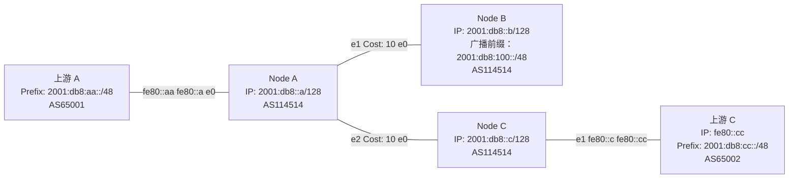

import { Aside, Tabs, TabItem } from "@astrojs/starlight/components";

现在让我们构建一个 Lab，综合运用前面学习过的 IGP 与 iBGP 协议。拓扑结构如下图所示：




细心的你可能已经注意到，此处我们采用的是回环地址（Loopback IP）。这是因为在部署 iBGP 时，有一个被广泛认可的最佳实践：在存在 IGP 的网络环境中，建议使用回环地址作为 iBGP 的建立地址。这样一来，即便节点间的物理链路发生变化，IGP 也能及时收敛并更新路径，实现协议层次的合理分离。

当然，若两个节点之间是点对点直连（PtP），也可以直接使用接口地址建立 iBGP 会话，这在简单拓扑中也非常常见。

本实验采用 RR（Route Reflector）配置方式，指定 Node A 作为 RR 节点。`functions.conf` 等基础配置沿用我们[在前一章节中的内容](/beginner/connect-with-others/lab)，此处不再赘述。

# 配置

## IGP

<Tabs syncKey="node">

<TabItem label="Node A">

```bird2
protocol ospf v3 ospfv3 {
    ipv6;
    area 0 {
        interface "e1" {
            cost 10;
            type ptp;
        };
        interface "e2" {
            cost 10;
            type ptp;
        };
        interface "dummy0" {
            stub;
        };
    };
}
```

</TabItem>

<TabItem label="Node B">

```bird2
protocol ospf v3 ospfv3 {
    ipv6;
    area 0 {
        interface "e0" {
            cost 10;
            type ptp;
        };
        interface "dummy0" {
            stub;
        };
    };
}
```

</TabItem>

<TabItem label="Node C">

```bird2
protocol ospf v3 ospfv3 {
    ipv6;
    area 0 {
        interface "e0" {
            cost 10;
            type ptp;
        };
        interface "dummy0" {
            stub;
        };
    };
}
```

</TabItem>

</Tabs>

## eBGP

<Tabs syncKey="node">

<TabItem label="Node A">

```bird2
protocol bgp upstream {
    local fe80::a as 114514;
    neighbor fe80::aa%e0 as 65001;
    direct;
    ipv6 {
        import where import_filter_upstream();
        export where export_filter_upstream();
    };
    graceful restart;
};
```

</TabItem>

<TabItem label="Node C">

```bird2
protocol bgp upstream {
    local fe80::c as 114514;
    neighbor fe80::cc%e0 as 65001;
    direct;
    ipv6 {
        import where import_filter_upstream();
        export where export_filter_upstream();
    };
    graceful restart;
};
```

</TabItem>

</Tabs>

## iBGP

<Tabs syncKey="node">

<TabItem label="Node A">

```bird2
template bgp ibgp {
    local 2001:db8::a as 114514;
	multihop 2;
    ipv6 {
        import all;
        export all;
    };
    rr client;
    graceful restart;
}

protocol bgp node_b from ibgp {
    neighbor 2001:db8::b as 114514;
}

protocol bgp node_c from ibgp {
    neighbor 2001:db8::c as 114514;
}
```

</TabItem>

<TabItem label="Node B">

```bird2
protocol bgp node_a {
	local 2001:db8::b as 114514;
	neighbor 2001:db8::a as 114514;
	multihop 2;
    ipv6 {
        import all;
        export all;
    };
    graceful restart;
}
```

</TabItem>

<TabItem label="Node C">

```bird2
protocol bgp node_a {
	local 2001:db8::c as 114514;
	neighbor 2001:db8::a as 114514;
	multihop 2;
    ipv6 {
        import all;
        export all;
    };
    graceful restart;
}
```

</TabItem>

</Tabs>

## 全部配置

<Tabs syncKey="node">

<TabItem label="Node A">

```bird2
include "functions.conf";
log syslog all;
router id 1.1.1.1;
protocol device {
};

protocol kernel {
    ipv6 {
        export all;
    };
};

protocol ospf v3 ospfv3 {
    ipv6;
    area 0 {
        interface "e1" {
            cost 10;
            type ptp;
        };
        interface "e2" {
            cost 10;
            type ptp;
        };
        interface "dummy0" {
            stub;
        };
    };
}

protocol bgp upstream {
    local fe80::a as 114514;
    neighbor fe80::aa%e0 as 65001;
    direct;
    ipv6 {
        import where import_filter_upstream();
        export where export_filter_upstream();
    };
    graceful restart;
};

template bgp ibgp {
    local 2001:db8::a as 114514;
	multihop 2;
    ipv6 {
        import all;
        export all;
    };
    rr client;
    graceful restart;
}

protocol bgp node_b from ibgp {
    neighbor 2001:db8::b as 114514;
}

protocol bgp node_c from ibgp {
    neighbor 2001:db8::c as 114514;
}
```

</TabItem>

<TabItem label="Node B">

```bird2
log syslog all;
router id 1.1.1.2;
protocol device {
};

protocol kernel {
    ipv6 {
        export all;
    };
};

protocol ospf v3 ospfv3 {
    ipv6;
    area 0 {
        interface "e0" {
            cost 10;
            type ptp;
        };
        interface "dummy0" {
            stub;
        };
    };
}

protocol static {
    ipv6;
    route 2001:db8:100::/48 reject {bgp_large_community.add((114514,1,3));};
}

protocol bgp node_a {
	local 2001:db8::b as 114514;
	neighbor 2001:db8::a as 114514;
	multihop 2;
    ipv6 {
        import all;
        export all;
    };
    graceful restart;
}
```

</TabItem>

<TabItem label="Node C">

```bird2
log syslog all;
router id 1.1.1.3;
protocol device {
};

protocol kernel {
    ipv6 {
        export all;
    };
};

protocol ospf v3 ospfv3 {
    ipv6;
    area 0 {
        interface "e0" {
            cost 10;
            type ptp;
        };
        interface "dummy0" {
            stub;
        };
    };
}

protocol bgp upstream {
    local fe80::c as 114514;
    neighbor fe80::cc%e0 as 65002;
    direct;
    ipv6 {
        import where import_filter_upstream();
        export where export_filter_upstream();
    };
    graceful restart;
};

protocol bgp node_a {
	local 2001:db8::c as 114514;
	neighbor 2001:db8::a as 114514;
	multihop 2;
    ipv6 {
        import all;
        export all;
    };
    graceful restart;
}
```

</TabItem>

</Tabs>

## 验证

<Tabs syncKey="node">
<TabItem label="Upstream A">

```bash
root@debian:~# birdc s r
BIRD 2.17.1 ready.
Table master6:
2001:db8:aa::/48     unreachable [static1 04:33:32.394] * (200)
2001:db8:100::/48    unicast [bgp1 04:44:21.386] * (100) [AS114514i]
	via fe80::a on ens3
root@debian:~#
```

</TabItem>

<TabItem label="Node A">

```bash
root@debian:~# birdc s r
BIRD 2.17.1 ready.
Table master6:
2001:db8::b/128      unicast [ospfv3 04:44:17.618] * I (150/10) [1.1.1.2]
	via fe80::525b:9dff:fe00:100 on ens4
                     unicast [node_b 04:44:21.087 from 2001:db8::b] (100/10) [i]
	via fe80::525b:9dff:fe00:100 on ens4
                     unicast [node_c 04:48:37.945 from 2001:db8::c] (100/10) [i]
	via fe80::52dd:ddff:fe00:200 on ens5
2001:db8:aa::/48     unicast [upstream 04:38:54.271] * (100) [AS65001i]
	via fe80::aa on ens3
2001:db8:cc::/48     unicast [node_c 04:50:54.638 from 2001:db8::c] * (100/10) [AS65002i]
	via fe80::52dd:ddff:fe00:200 on ens5
2001:db8::c/128      unicast [ospfv3 04:48:36.618] * I (150/10) [1.1.1.3]
	via fe80::52dd:ddff:fe00:200 on ens5
                     unicast [node_b 04:48:37.031 from 2001:db8::b] (100/10) [i]
	via fe80::525b:9dff:fe00:100 on ens4
                     unicast [node_c 04:48:37.945 from 2001:db8::c] (100/10) [i]
	via fe80::52dd:ddff:fe00:200 on ens5
2001:db8::a/128      unicast [ospfv3 04:41:48.619] * I (150/0) [1.1.1.1]
	dev dummy0
                     unicast [node_b 04:44:21.087 from 2001:db8::b] (100/10) [i]
	via fe80::525b:9dff:fe00:100 on ens4
                     unicast [node_c 04:48:37.945 from 2001:db8::c] (100/10) [i]
	via fe80::52dd:ddff:fe00:200 on ens5
2001:db8:100::/48    unicast [node_b 04:44:21.087 from 2001:db8::b] * (100/10) [i]
	via fe80::525b:9dff:fe00:100 on ens4
root@debian:~#
```

</TabItem>

<TabItem label="Node B">

```bash
root@debian:~# birdc s r
BIRD 2.17.1 ready.
Table master6:
2001:db8::b/128      unicast [ospfv3 04:43:10.297] * I (150/0) [1.1.1.2]
	dev dummy0
                     unicast [node_a 04:44:21.515 from 2001:db8::a] (100/10) [i]
	via fe80::52fe:b6ff:fe00:301 on ens3
2001:db8:aa::/48     unicast [node_a 04:44:21.515 from 2001:db8::a] * (100/10) [AS65001i]
	via fe80::52fe:b6ff:fe00:301 on ens3
2001:db8:cc::/48     unicast [node_a 04:50:55.068 from 2001:db8::a] * (100/20) [AS65002i]
	via fe80::52fe:b6ff:fe00:301 on ens3
2001:db8::c/128      unicast [ospfv3 04:48:37.459] * I (150/20) [1.1.1.3]
	via fe80::52fe:b6ff:fe00:301 on ens3
                     unicast [node_a 04:48:37.048 from 2001:db8::a] (100/10) [i]
	via fe80::52fe:b6ff:fe00:301 on ens3
2001:db8::a/128      unicast [ospfv3 04:44:17.459] * I (150/10) [1.1.1.1]
	via fe80::52fe:b6ff:fe00:301 on ens3
                     unicast [node_a 04:44:21.515 from 2001:db8::a] (100/10) [i]
	via fe80::52fe:b6ff:fe00:301 on ens3
2001:db8:100::/48    unreachable [static1 04:43:10.196] * (200)
root@debian:~# 
```

</TabItem>

<TabItem label="Node C">

```bash
root@debian:~# birdc s r
BIRD 2.17.1 ready.
Table master6:
2001:db8::b/128      unicast [ospfv3 04:48:38.195] * I (150/20) [1.1.1.2]
	via fe80::52fe:b6ff:fe00:302 on ens3
                     unicast [node_a 04:48:38.547 from 2001:db8::a] (100/10) [i]
	via fe80::52fe:b6ff:fe00:302 on ens3
2001:db8:aa::/48     unicast [node_a 04:48:38.547 from 2001:db8::a] * (100/10) [AS65001i]
	via fe80::52fe:b6ff:fe00:302 on ens3
2001:db8:cc::/48     unicast [upstream 04:50:55.240] * (100) [AS65002i]
	via fe80::cc on ens4
2001:db8::c/128      unicast [ospfv3 04:48:23.195] * I (150/0) [1.1.1.3]
	dev dummy0
                     unicast [node_a 04:48:38.547 from 2001:db8::a] (100/10) [i]
	via fe80::52fe:b6ff:fe00:302 on ens3
2001:db8::a/128      unicast [ospfv3 04:48:38.195] * I (150/10) [1.1.1.1]
	via fe80::52fe:b6ff:fe00:302 on ens3
                     unicast [node_a 04:48:38.547 from 2001:db8::a] (100/10) [i]
	via fe80::52fe:b6ff:fe00:302 on ens3
2001:db8:100::/48    unicast [node_a 04:48:38.547 from 2001:db8::a] * (100/20) [i]
	via fe80::52fe:b6ff:fe00:302 on ens3
root@debian:~# 
```

</TabItem>

<TabItem label="Upstream C">

```bash
root@debian:~# birdc s r
BIRD 2.17.1 ready.
Table master6:
2001:db8:cc::/48     unreachable [static1 04:49:59.628] * (200)
2001:db8:100::/48    unicast [bgp1 04:50:55.368] * (100) [AS114514i]
	via fe80::c on ens3
root@debian:~# 
```

</TabItem>

</Tabs>

可以看到， Node B上广播的路由已经成功地被发送到了Upstream A和C，并且能够按照最优路径前往Upstream A和C的路由。

# 后续

你可能会好奇：如果网络规模更大，两个有 BGP 会话的节点之间并非直连，而是需要经过多个中间节点进行转发，这种情况下该如何处理？

在当前场景下，可以通过设置 RR，使中间节点同样获得 BGP 路由表，从而具备中转能力。但如果中间节点的内存资源较为紧张，无法完整承载 BGP 全表，又该怎么办？

这时候，我们就需要引入一种名为 **MPLS（多协议标签交换）** 的技术。MPLS 能够有效解决这一问题，不过它属于进阶内容，因此不会在本系列入门教程中展开介绍（TODO）。如果你对此感兴趣，可以自行查阅资料~~或者等待我将高级教程“咕咕咕”出来~~ 。
