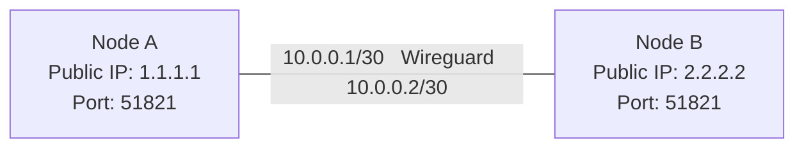
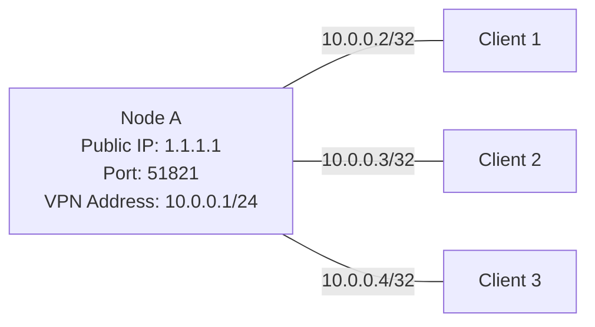

import { Aside, Tabs, TabItem } from "@astrojs/starlight/components";

看完前面的文章后，你可能会有这样的疑惑：上面的什么 IGP、iBGP 都需要节点之间直接连通，但我的设备都部署在公网上，该如何建立连接呢？这个时候，我们就要用到隧道了。

为了方便各位读者，速查表如下：

| 隧道方案  | 承载协议 | 包内容   | IPv4 / IPv6 承载 MTU（以 1500 计） | 主要优点                                  | 主要缺点                                                     |
| --------- | -------- | -------- | ---------------------------------- | ----------------------------------------- | ------------------------------------------------------------ |
| Wireguard | UDP      | IP       | 1440（-60） / 1420（-80）          | 带加密<br/>效率高<br/>带路由              | 老设备/商业网络设备不支持                                    |
| SIT       | IPv4     | IPv6     | 1480（-20） / 一般不支持           | 包头小                                    | 不带加密<br/>同 IP 间不能起多个隧道<br/>一般只支持 IPv4 作为承载协议 |
| GRE       | IP       | IP       | 1476（-24） / 1456（-44）          | 通用                                      | 一般不带加密；同 IP 间不能起多个隧道<br/>包头略大            |
| L2GRE     | IP       | 以太网帧 | 1476（-24） / 1456（-44）          | 能传输二层以太网帧                        | 多了一个以太网的头，不需要的时候包头大<br/>同 IP 间不能起多个隧道 |
| VXLAN     | UDP      | 以太网帧 | 1456（-44） / 1436（-64）          | 能传输二层以太网帧<br/>同 IP 可开多个隧道 | 多了一个以太网的头，不需要的时候包头大                       |

# 什么是隧道

网络隧道如同物理世界中穿山而过的隧道一样，在网络中的两个节点之间搭建了一条虚拟的"直连通道"。即使数据需要经过多台路由器转发，隧道两端的设备也能像直接相连一样进行通信，这样就能够部署 IGP、BGP 等路由协议了。

如果不严谨的分类一下，隧道可以分类成这几种：

- L2 隧道：传输的内容为二层包，如以太网等。典型代表有 L2TP、VXLAN、L2GRE。这种隧道可以看成直接用一条网线把两端连了起来，因此可以跑一些比较低级的协议，比如 MPLS、ISIS 等。

- L3 隧道：传输的内容为三层包，如 IPv4、IPv6 等。典型代表有 GRE、SIT、IPIP，以及我们即将讲解的 Wireguard。这种隧道可以看作把两端接了一个路由器，因此可以跑 IP，但是没法用一些比较低级的协议，比如 ARP、MPLS 等。

  <Aside>有一个特例，MPLS可以运行在GRE上，详情在 RFC4023 。</Aside>

我们平常会用到的隧道主要有 Wireguard、VXLAN、SIT、GRE 和 L2GRE。

# Wireguard

## 介绍

> WireGuard ® 是一个极其简单但快速且现代的 VPN，采用最先进的加密技术。它旨在比 IPsec 更快、更简单、更精简且更实用，同时避免带来巨大的麻烦。它的性能预计远超 OpenVPN。WireGuard 被设计为通用 VPN，适用于嵌入式接口和超级计算机，适合多种不同场景。最初发布于 Linux 内核，现在已实现跨平台（Windows、macOS、BSD、iOS、Android）并广泛部署。它目前正处于积极开发阶段，但已经可以被视为业内最安全、最易用、最简洁的 VPN 解决方案。

简而言之，Wireguard 是一种很新的基于 UDP 的 L3 隧道，而且自带加密，基本可以视作 IPsec 的上位平替，目前已被包括广泛使用，连 Tailscale 也是基于 Wireguard 构建，而它也是我们这篇文章的重头戏。

## 配置

Wireguard 有一个很有特色的地方，那就是它自带了一定的路由功能，因此我们既可以用它来作为两个 BGP 节点之间的连接，也可以用它来连接节点和客户端，从而把广播的 IP 分配给客户端。下面将讲解两种不同的配置方法。

Wireguard 的包头大小为 40 字节，因此如果使用 IPv4 则内层还剩下 1440 字节，使用 IPv6 则内层还剩下 1420 字节。

### 节点之间

假设网络拓扑如下：



#### 生成密钥对

在 `/etc/wireguard` 目录下运行

```bash
 wg genkey | tee privatekey | wg pubkey > publickey
```

就会生成一对公钥和私钥，分别保存在 `/etc/wireguard/publickey` 和 `/etc/wireguard/privatekey` 下。

#### 编写配置文件

在 `/etc/wireguard` 目录下创建配置文件 `<对端名称>.conf`（建议使用字母、数字、连字符或下划线命名，如 `node-a.conf`）：

<Tabs>

<TabItem label="Node A">

```ini frame="code" title="node-b.conf"
[Interface]
PrivateKey = <Node A privatekey>
ListenPort = 51821
Address = 10.0.0.1/30
Table = off

[Peer]
PublicKey = <Node B publickey>
Endpoint = 2.2.2.2:51821
AllowedIPs = ::/0, 0.0.0.0/0
PersistentKeepalive = 120
```

</TabItem>

<TabItem label="Node B">

```ini frame="code" title="node-a.conf"
[Interface]
PrivateKey = <Node B privatekey>
ListenPort = 51821
Address = 10.0.0.2/30
Table = off

[Peer]
PublicKey = <Node A publickey>
Endpoint = 1.1.1.1:51821
AllowedIPs = ::/0, 0.0.0.0/0
PersistentKeepalive = 120
```

</TabItem>

</Tabs>

可以看到 Wireguard 配置文件由 `[Interface]` 和 `[Peer]` 两部分组成。一个配置文件可以有多个`[Peer]`，其中 `AllowedIPs` 互不重叠（因为要拿来路由）。

<Aside type="note">
  注意 `AllowedIPs` 是隧道里面传输的 IP 包的地址，不只是接口地址。
  另外，Endpoint 可以两边都写，也可以只写一遍（例如只有一边有公网
  IP），但不能两边都不写！
</Aside>

这里我们写了一行

```ini startLineNumber=6
Table = off
```

意思是让 Wireguard 不要根据 AllowedIPs 往系统路由里写路由表，此时我们只把 Wireguard 当成一个隧道来用，由我们自己控制路由

还有

```ini
PersistentKeepalive = 120
```

意思是让 Wireguard 每 120 秒发送一个 KeepAlive 包，这在 NAT 的时候比较有用。

#### 启动隧道与持久化

运行

```bash
wg-quick up <文件名，如 node-a>
```

如果没有报错，那么隧道就成功启动了。我们可以输入 `wg show <文件名>` 来查看情况。

如果你的系统使用 systemd，那么你可以使用

```bash
systemctl enable wg-quick@<文件名>
```

来让你的隧道在开机的时候自动启动。

### 节点和客户端

上面的节点互联，我们将 Wireguard 用成了一个单独的隧道，让它不加选择地通过所有流量。而对于连接节点和客户端则刚好相反，我们正好需要使用 Wireguard 写路由表的特性来路由我们的流量，假设情景如下：



配置示例如下：

<Tabs>

<TabItem label="Node A">

```ini frame="code" title="clients.conf"
[Interface]
PrivateKey = <Node A privatekey>
ListenPort = 51821
Address = 10.0.0.1/24

[Peer]
PublicKey = <Client 1 publickey>
AllowedIPs = 10.0.0.2/32
PersistentKeepalive = 120

[Peer]
PublicKey = <Client 2 publickey>
AllowedIPs = 10.0.0.3/32
PersistentKeepalive = 120

[Peer]
PublicKey = <Client 3 publickey>
AllowedIPs = 10.0.0.4/32
PersistentKeepalive = 120
```

</TabItem>

<TabItem label="Client 1">

```ini frame="code" title="node-a.conf"
[Interface]
PrivateKey = <Client 1 privatekey>
Address = 10.0.0.2/24

[Peer]
PublicKey = <Node A publickey>
Endpoint = 1.1.1.1:51821
AllowedIPs = ::/0, 0.0.0.0/0
PersistentKeepalive = 120
```

</TabItem>

<TabItem label="Client 2">

```ini frame="code" title="node-a.conf"
[Interface]
PrivateKey = <Client 2 privatekey>
Address = 10.0.0.3/24

[Peer]
PublicKey = <Node A publickey>
Endpoint = 1.1.1.1:51821
AllowedIPs = ::/0, 0.0.0.0/0
PersistentKeepalive = 120
```

</TabItem>

<TabItem label="Client 3">

```ini frame="code" title="node-a.conf"
[Interface]
PrivateKey = <Client 3 privatekey>
Address = 10.0.0.4/24

[Peer]
PublicKey = <Node A publickey>
Endpoint = 1.1.1.1:51821
AllowedIPs = ::/0, 0.0.0.0/0
PersistentKeepalive = 120
```

</TabItem>

</Tabs>

可以看到在这里我们把`Table = off`给去掉了，以让 Wireguard 自动把路由写进路由表。Client 方面，由于我们去掉了`ListenPort`，它就会自动选择端口与 Node A 连接。而 Node A 方面，通过只给 Client 留它们对应的 IP 作为 AllowedIPs，既让 Wireguard 知道如何路由对应的数据包，也限制了 Client 让它们不能盗用 IP。

{/* prettier-ignore */}
<Aside type="note">
  - 当 Wireguard 上的 IP 为 /24 而 AllowedIPs 为该 /24 下的 IP 时，Wireguard 不会添加 /32 路由，此时如果要在 BIRD 内读取路由，需要使用 protocol direct 或者写一个 static reject 。
  - 当 Wireguard 上的 IP 为 /32 时，Wireguard 会添加路由，此时 BIRD 内只需写一条 static reject 即可。
</Aside>

当然，自己手写客户端配置还是比较麻烦的事情，我们可以使用 [wg-gen-web](https://github.com/vx3r/wg-gen-web) 来管理客户端。网上教程不少，如 https://icloudnative.io/posts/configure-wireguard-using-wg-gen-web/ ，此处不再赘述。

# SIT

SIT 隧道，也被称作 6in4，是用来在 IPv4 网络上传输 IPv6 的一种隧道（看名字也知道了）。它是一种不带安全加密和路由的 L3 隧道。SIT 只需要一层 IPv4 头，故其在 1500 下的 MTU 为 1480。其配置方法如下：

```bash
ip link add name sit1 type sit local <本地IP> remote <对方IP>
ip link set sit1 up
ip addr add <内部v6地址CIDR> dev sit1
```

如果想持久化可以将其写入 `/etc/rc.local` ，并配置系统启用它。

# GRE

GRE（**G**eneric **R**outing **E**ncapsulation，通用路由封装，RFC2784），是一种常用的 L3 隧道。跟 SIT 的区别是 GRE 有一个 GRE 头，这使得它可以传输任何 L3 包而不仅限于 IP。GRE 的包头大小为 4 字节，故其在 IPv4 下的 MTU 为 1476，在 IPv6 下的 MTU 为 1456。GRE 本身不带加密，但可以和 IPsec 组成加密隧道，具体方法请自行搜索。

配置方法如下：

<Tabs>

<TabItem label="IPv4">

```bash
ip link add name gre1 type gre local <本地IP> remote <对方IP>
ip link set gre1 up
ip addr add <内部地址CIDR> dev gre1
```

</TabItem>

<TabItem label="IPv6">

```bash
ip link add name gre1 type ip6gre local <本地IPv6> remote <对方IPv6>
ip link set gre1 up
ip addr add <内部地址CIDR> dev gre1
```

</TabItem>

</Tabs>

如果外层地址是 IPv4 就用`gre`，是 IPv6 就用`ip6gre`。如果需要在同一对地址间起多个 GRE 隧道，则需要使用 GENEVE（RFC8926）。

## L2GRE

L2GRE（又称 EoGRE、GRETAP，RFC1701），是一种更底层的 GRE。它跟 GRE 的区别是，GRE 内层不是一个 IP 包，而是一个以太网帧，此时它就成为了一个 L2 隧道，GRE 头内的协议号为 6558（Transparent Ethernet Bridging）。MTU 跟普通 GRE 相同，但此时内层包的内容更大。

配置方法如下（就是把 gre 改成 gretap）：

<Tabs>

<TabItem label="IPv4">

```bash
ip link add name gre1 type gretap local <本地IP> remote <对方IP>
ip link set gre1 up
ip addr add <内部地址CIDR> dev gre1
```

</TabItem>

<TabItem label="IPv6">

```bash
ip link add name gre1 type ip6gretap local <本地IPv6> remote <对方IPv6>
ip link set gre1 up
ip addr add <内部地址CIDR> dev gre1
```

</TabItem>

</Tabs>

L2GRE 能传输以太网帧这一特点使得它可以被加入一个桥中。

# VXLAN

VXLAN（Virtual eXtensible Local Area Network，RFC7348）是一种 L2 隧道。准确来说，是一种网络虚拟化技术。它跟 L2GRE 的一个显著区别是，L2GRE 是 Ethernet over GRE over IP，VXLAN 是 Ethernet over VXLAN over UDP over IP，多了一层 UDP。此外，VXLAN 还支持同一对 IP 上跑多个隧道，使用 VNI（VXLAN Network Identifier）进行区分。搭配上 EVPN，VXLAN 还有更多的玩法，不过这就是后话了（TODO）。

Wireguard 的包头大小为 16 字节，因此如果使用 IPv4 则内层还剩下 1456 字节，使用 IPv6 则内层还剩下 1436 字节。

配置方法如下：

```bash
ip link add name vxlan1 type vxlan local <本地IP> remote <对方IP> dstport 4789 id <id>
ip link set vxlan1 up
ip addr add <内部地址CIDR> dev vxlan1
```

相比于别的协议，VXLAN 多了一个`dstport`（默认为 4789）和一个`id`，也就是上文所说的 VNI。但配置方法大同小异。

---

建立起隧道之后，节点之间的距离就从跨越多跳缩短为了一跳可达，此时就可以使用我们前面讲过的方法搭建网络了。
